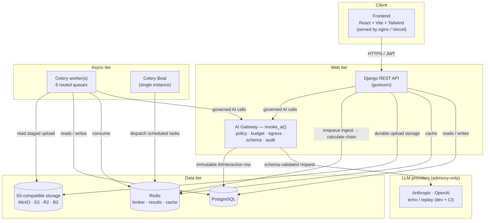

<div align="center">

# ScopeTrace

### Enterprise ESG Compliance & AI Governance Platform

A production-grade, full-stack platform for corporate greenhouse-gas accounting — ingesting emissions data from heterogeneous enterprise sources, computing explainable CO₂e across Scopes 1/2/3, enforcing a tamper-evident governance & approval workflow, and layering **advisory-only, fully-governed AI** on top of a deterministic core.

[](https://github.com/Utkarshum7/scopetrace-platform/actions/workflows/backend-ci.yml)
[](https://github.com/Utkarshum7/scopetrace-platform/actions/workflows/frontend-ci.yml)
[](https://github.com/Utkarshum7/scopetrace-platform/actions/workflows/docker-build.yml)
[](https://github.com/Utkarshum7/scopetrace-platform/actions/workflows/secret-scan.yml)


</div>

---

## 📋 Overview

Modern enterprises collect environmental-impact data across fragmented systems: fuel purchases in SAP CSV exports, electricity invoices in utility tables, and business travel in JSON booking feeds. **ScopeTrace** is the centralized system of record that turns that mess into audit-grade, compliance-ready CO₂e reporting:

1. **Ingests** heterogeneous formats through a pluggable, strategy-pattern ingestion engine (SAP fuel / utility electricity / corporate travel).
2. **Validates & normalizes** every row in real time — structure, types, ranges, statistical anomalies — converting mixed units (litres, kWh, passenger-km) into standardized base activity units.
3. **Computes explainable CO₂e** via a deterministic **Carbon Intelligence Engine**: versioned, provenance-tracked emission factors (DEFRA/EPA/IPCC-ready), Decimal-precise, factor-pinned, with a self-contained calculation trace on every result.
4. **Governs** the data lifecycle: a formal Draft → Submitted → Approved/Rejected workflow, immutable version history, reversible soft delete, and a per-organization **cryptographic SHA-256 audit hash-chain** that makes tampering detectable.
5. **Assists with governed AI**: five advisory-only capabilities (anomaly explanation, factor recommendation, validation assistance, a conversational ESG assistant, and report narration) — every call routed through a single enforcement gateway with per-tenant policy, budget, egress-tier, and a complete reproducibility audit trail. **AI never mutates governed data; the deterministic engine always decides.**

Built over ten disciplined engineering phases (Phase 0 → 10), each with its own architecture review, design decisions, and milestone report — culminating in an independent [release certification](docs/RELEASE_CERTIFICATION.md) for **v1.0.0** with zero release blockers.

---

## ✨ Key Features

### Ingestion & Carbon Engine
- **Multi-adapter ingestion** — extensible `BaseParser` strategy pattern; adding a 4th source is three additive edits, zero changes to the orchestrator.
- **High-fidelity validation** — structure, type, mandatory-field, and range checks; one bad row never aborts a batch.
- **Anomaly detection** — deterministic flagging of out-of-range values (negative fuel, abnormal kWh) as `SUSPICIOUS`.
- **Carbon Intelligence Engine** — versioned, effective-dated, region-aware factor resolution; immutable, factor-pinned, Decimal-precise CO₂e with a full explainability trace and idempotent import/seed/backfill commands.

### Enterprise Governance
- **Cryptographic audit hash-chain** — per-organization SHA-256 chain over the audit ledger, verifiable on demand (tamper-*evident*).
- **Immutable version history** — every meaningful record edit snapshots an `EmissionRecordVersion`, with list / retrieve / field-diff APIs.
- **Formal approval workflow** — a fixed Draft → Submitted → Approved/Rejected state machine, enforced at the model layer.
- **Reversible soft delete** — governed data is never physically destroyed; `PROTECT` closes cascade-delete bypasses.
- **Compliance reporting** — CSV/JSON reports over APPROVED-only data, each embedding a chain-verification snapshot.

### Governed AI Layer
- **Single enforcement gateway** — every production AI call flows through `invoke_ai()`: idempotency → policy → budget → egress → schema-render → provider → schema-validate → immutable `AIInteraction` audit row.
- **Per-tenant AI policy** — global kill switch (`AI_ENABLED=False` by default — zero cost/egress out of the box), per-org model / budget / egress-tier controls.
- **Advisory-only by construction** — the gateway has no write path to `EmissionRecord`/`EmissionCalculation`; structurally enforced by an import guard.
- **Evaluation harness** — golden datasets, an I1–I6 invariant suite as a CI merge gate, deterministic replay providers, and an LLM-as-Judge framework.

### Platform & Operations
- **Enterprise identity & access** — JWT (rotation + logout blacklist), four org-scoped roles + a cross-tenant Platform Admin, server-side multi-tenant isolation.
- **Async processing** — Celery + Redis across six routed queues, with retry/backoff, a dead-letter queue, and scheduled maintenance sweeps.
- **Observability** — request-ID-correlated structured logs (UTC), three health endpoints, gunicorn access logging, and AI cost/usage dashboards.
- **Analytics dashboards** — a cached, tenant-scoped Metrics API powering a role-aware, pluggable dashboard with KPI cards, trend charts, and skeleton/empty/error states.

---

## 🏛️ System Architecture

High-level component view (full diagrams — async pipeline sequence, queue topology — in [`docs/ARCHITECTURE_OVERVIEW.md`](docs/ARCHITECTURE_OVERVIEW.md)):



**The core async pipeline** — `POST /api/upload/…` durably stores the file, creates an `UploadBatch`, and enqueues a Celery `chain(ingest_task, calculate_task)`; a fire-and-forget notification closes it out. A stable `workflow_id` correlates every log line across the chain. Deterministic calculation always runs first and commits; advisory AI enrichment is dispatched separately afterward and can never delay or alter it.

---

## 🛠️ Technology Stack

| Layer | Technologies |
| :--- | :--- |
| **Frontend** | React 18 · Vite 5 · Tailwind CSS 3 · TanStack Query · Recharts · Axios |
| **Backend** | Python 3.12 · Django 6.0 · Django REST Framework 3.17 · SimpleJWT · django-filter |
| **Async & messaging** | Celery 5 · Redis (broker + result backend + cache) |
| **AI** | Provider-agnostic gateway · Anthropic & OpenAI SDKs · `jsonschema` response enforcement |
| **Database** | PostgreSQL 16 (production) · SQLite (local dev only) |
| **Object storage** | S3-compatible via `StorageService` — AWS S3 / Cloudflare R2 / Backblaze B2 / MinIO |
| **Serving & infra** | Gunicorn · WhiteNoise · Docker · Docker Compose |
| **Deployment** | Backend → Render · Frontend → Vercel (both fully containerized/portable) |
| **CI/CD** | GitHub Actions × 4 (backend, frontend, Docker build, secret scan) · `pip-audit` · `npm audit` · `gitleaks` |

---

## 🤖 AI Architecture Summary

ScopeTrace treats AI as an **advisory layer over a deterministic core**, not a decision-maker. Full detail in [`docs/AI_ARCHITECTURE.md`](docs/AI_ARCHITECTURE.md).

- **One enforcement point.** `apps/ai/services/gateway.py::invoke_ai()` is the *sole* path any production AI call may take. No caller constructs a provider, renders a prompt, or writes an `AIInteraction` directly — an import guard (`tests_import_guard`) makes bypassing it structurally impossible.
- **Governed on every call.** In order: idempotency short-circuit → per-tenant policy resolution → budget check → egress-tier enforcement → schema lookup → PII redaction + prompt render → provider call → response schema validation → immutable audit-row write.
- **Five capabilities, all advisory:** ① anomaly explanation, ② emission-factor recommendation, ③ validation assistance, ④ a conversational ESG assistant (structured retrieval, tenant/RBAC-aware), ⑤ compliance-report narration (built only from APPROVED data).
- **Concurrency-safe.** A per-organization lock serializes budget-check → provider-call → write, closing budget-overspend and duplicate-paid-call races; idempotent calls replay an identical result.
- **Cost-governed & observable.** Per-tenant monthly budgets, egress tiers (REDACTED / RAW / NO_EGRESS), and platform-level usage/latency/cost dashboards — all built from data the gateway already writes.
- **Safe by default.** `AI_ENABLED=False` ships as the default: the entire AI layer is inert (no provider constructed, no cost, no egress) until a tenant explicitly opts in.

---

## 🔐 Governance & Security Highlights

**Governance** (see [`docs/GOVERNANCE.md`](docs/GOVERNANCE.md)):
- Per-org **SHA-256 audit hash-chain**, tamper-evident, verifiable via `GET /api/audit/verify/`.
- Immutable `EmissionRecordVersion` snapshots on every meaningful edit.
- Model-enforced Draft → Submitted → Approved/Rejected workflow with distinct RBAC per transition.
- Reversible soft delete; APPROVED records are audit-locked against business-field edits.
- Bulk `.update()`/`.delete()` blocked at the QuerySet layer so nothing bypasses `clean()` or the audit trail.

**Security** (see [`docs/SECURITY.md`](docs/SECURITY.md)):
- **Fail-closed config** — with `DEBUG=False` the app refuses to boot without `SECRET_KEY`/`DATABASE_URL`, rejects wildcard `ALLOWED_HOSTS`, and requires S3 storage.
- **JWT** — 15-min access / 7-day refresh, rotation + blacklist-after-rotation; failed logins logged (never the password).
- **Multi-tenant isolation** — every queryset filtered server-side by resolved organization; org scope is never taken from a client parameter.
- **Hardened surface** — CORS/CSRF locked down, secure cookies + HSTS in production, DRF throttling (anon/user/login/AI scopes), upload file-type allowlist with server-side content-type verification, CSV formula-injection sanitization, and JSON-only Celery serialization (no pickle RCE surface).
- **Supply chain** — pinned dependencies, no known CVEs at the pinned versions, and a `gitleaks` secret-scan gate over full git history.

---

## 🧪 Testing Statistics

| Suite | Count | Notes |
| :--- | :--- | :--- |
| **Backend** | **915** tests | Run against real **PostgreSQL 16 + Redis 7** service containers in CI — not SQLite/eager-mode |
| **Frontend** | **92** tests | Vitest + React Testing Library |
| **Total** | **1,007** | Green on every commit across 4 GitHub Actions workflows |

Coverage highlights: every concurrent code path (`select_for_update` on AI budget/idempotency, approval transitions, soft delete, versioning, audit append, metrics-cache bump) has a dedicated multi-threaded race test; the AI evaluation harness ships an I1–I6 invariant suite enforced as a CI merge gate. Full strategy: [`docs/CI_CD.md`](docs/CI_CD.md).

---

## 📁 Folder Structure

```
scopetrace-platform/
├── backend/                     # Django + DRF + Celery
│   ├── apps/
│   │   ├── core/                # Cross-cutting: storage, health, middleware, notifications
│   │   ├── accounts/            # Auth, RBAC, JWT, multi-tenant resolution
│   │   ├── ingestion/           # Upload → parse → validate → normalize (strategy parsers)
│   │   ├── carbon/              # Carbon Intelligence Engine, factors, metrics, reports
│   │   ├── audit/               # Audit trail + cryptographic hash-chain
│   │   ├── tasks/               # Celery plumbing, dead-letter queue
│   │   ├── ai/                  # AI gateway, 5 capabilities, providers, policy/budget/egress
│   │   │   └── evaluation/      # Golden datasets, invariant suite, LLM-as-Judge
│   │   └── ...
│   ├── config/                  # settings, celery, wsgi, urls
│   ├── Dockerfile · entrypoint.sh · requirements.txt
├── frontend/                    # React + Vite + Tailwind SPA
│   └── src/{pages,components,context,hooks,services,utils}/
├── docs/                        # ~30 architecture, design & operations docs (+ ADRs)
├── sample_data/                 # Example SAP / utility / travel files
├── docker-compose.yml           # Full local stack (7 services)
├── render.yaml                  # Backend IaC (Render Blueprint)
└── .github/workflows/           # 4 CI pipelines
```

---

## 🚀 Quick Start

### Option A — Docker Compose (recommended, exercises the real architecture)

The full stack — PostgreSQL, Redis, MinIO (S3-compatible storage), the Django API, a Celery worker, Celery Beat, and the built frontend — runs with a single command. Data persists in named volumes across restarts.

```bash
docker compose up --build
```

| Service | URL |
| :--- | :--- |
| Frontend | http://localhost:8080 |
| API (browsable) | http://localhost:8000/api/ |
| Health check | http://localhost:8000/healthz |
| Worker health check | http://localhost:8000/healthz/worker/ |
| Django Admin | http://localhost:8000/admin/ (`admin` / `admin12345` by default) |
| MinIO console | http://localhost:9001 (`scopetrace` / `scopetrace123` by default) |

On first start the API container runs migrations, collects static files, and seeds baseline data (one demo Organization, three DataSources, an admin user, and one demo user per role — `orgadmin`/`analyst`/`auditor`/`viewer`, password `demo12345`) — so the app, including full async upload processing, is usable immediately.

```bash
docker compose up --scale worker=3 -d              # horizontal worker scaling, zero code change
docker compose --profile monitoring up -d flower   # optional Celery monitoring UI (docs/FLOWER.md)
docker compose down          # stop, keep named volumes
docker compose down -v       # stop and delete volumes (fresh start)
```

### Option B — Local setup (without Docker)

> **Configuration fails closed.** With `DEBUG=False` the backend refuses to start unless `SECRET_KEY` and `DATABASE_URL` are set. For local dev set `DEBUG=True` (SQLite is then used automatically when `DATABASE_URL` is blank). See `backend/.env.example`.

**Prerequisites:** Python 3.12+ · Node.js 18+ & npm · Git

```bash
# Backend
cd backend
python -m venv venv && source venv/bin/activate    # .\venv\Scripts\activate on Windows
pip install -r requirements.txt
python manage.py migrate
python manage.py bootstrap_data --demo-users        # seed demo org, data sources, users
python manage.py runserver                          # → http://localhost:8000/api/

# Frontend (new terminal)
cd frontend
npm install
npm run dev                                         # → http://localhost:5173/
```

Run the test suites:

```bash
cd backend && python manage.py test --verbosity=2   # backend
cd frontend && npm test                             # frontend
```

### Try the full workflow

With the stack running and demo data seeded:

1. **Sign in** at the frontend as `analyst` / `demo12345`.
2. **Upload** a file from [`sample_data/`](sample_data/) in the Upload Center (e.g. the SAP fuel sample against the *SAP Fuel Feed* source).
3. **Review** the ingested rows in the Review Ledger — abnormal values are flagged `SUSPICIOUS`; if AI is enabled, advisory explanations appear alongside.
4. **Submit → Approve** a record (with a justification). It locks into the immutable, hash-chained Audit Trail; verify chain integrity via `GET /api/audit/verify/`.
5. **Report** — pull a compliance report (`/api/reports/compliance/`) over the APPROVED data.

Full operational detail — health checks, Celery operations, backup & recovery, production deployment — lives in [`docs/DEPLOYMENT_GUIDE.md`](docs/DEPLOYMENT_GUIDE.md) and [`docs/OPERATIONS_RUNBOOK.md`](docs/OPERATIONS_RUNBOOK.md).

---

## 🌐 Live Demo & Deployment

> 🚧 **To be filled after deployment.** ScopeTrace v1.0.0 is release-certified; the hosted environments are provisioned under the ScopeTrace namespace as part of the launch step.

| Environment / Service | URL |
| :--- | :--- |
| **Live frontend** (Vercel) | _`https://…` — to be filled after deployment_ |
| **Backend API** (Render) | _`https://…/api/` — to be filled after deployment_ |
| **API documentation** | _to be filled after deployment (OpenAPI/Swagger is planned — see roadmap)_ |
| **Django Admin** | _`https://…/admin/` — to be filled after deployment_ |

Deployment targets: **backend → Render** (`render.yaml` Blueprint: web + worker + beat + managed Redis + managed PostgreSQL) and **frontend → Vercel** (static Vite build). Both are fully portable via Docker Compose. Step-by-step first-deploy instructions: [`docs/DEPLOYMENT_GUIDE.md`](docs/DEPLOYMENT_GUIDE.md) §3, with a manual post-deploy verification pass in [`docs/SMOKE_TEST_CHECKLIST.md`](docs/SMOKE_TEST_CHECKLIST.md).

---

## 🖼️ Screenshots

> 🚧 **Placeholders — to be replaced with real product screenshots after deployment.**

| ESG Command Dashboard | Ingestion & Upload Center | Review & Audit Ledger |
| :---: | :---: | :---: |
|  |  |  |
| Carbon footprints, KPI cards, batch success rates, outstanding reviews | Drag-and-drop batch submission mapped to org data-source adapters | Raw vs. normalized values, suspicious-value flags, approval workflow |

---

## 📡 API Reference

<details>
<summary><strong>Full endpoint table</strong> (click to expand)</summary>

| Method | Endpoint | Auth | Description |
| :--- | :--- | :--- | :--- |
| `GET` | `/healthz` | none | Database-aware health probe (200 healthy / 503 if DB unreachable) |
| `GET` | `/healthz/worker/` | none | Celery worker liveness (real broker round trip + Beat heartbeat freshness) |
| `GET` | `/healthz/ai/` | none | AI foundation health (provider constructibility; healthy when disabled) |
| `POST` | `/api/auth/login/` | none | Obtain JWT access + refresh tokens and the user profile |
| `POST` | `/api/auth/refresh/` | none | Exchange a refresh token for a new access/refresh pair (rotated) |
| `POST` | `/api/auth/logout/` | Bearer | Blacklist the refresh token (logout) |
| `GET` | `/api/me/` | Bearer | Current user, active memberships, and resolved active organization |
| `GET` | `/api/organizations/` | Bearer | List organizations the caller belongs to (all orgs for Platform Admin) |
| `GET` | `/api/datasources/` | Bearer | List data sources for the active organization |
| `POST` | `/api/upload/sap/` | Bearer (Org Admin / Analyst) | Upload and parse SAP Fuel CSV |
| `POST` | `/api/upload/utility/` | Bearer (Org Admin / Analyst) | Upload and parse Utility Electricity CSV |
| `POST` | `/api/upload/travel/` | Bearer (Org Admin / Analyst) | Upload and parse Corporate Travel JSON |
| `GET` | `/api/batches/` | Bearer | List ingestion batches for the active organization |
| `GET` | `/api/records/` | Bearer | List emission records (status/anomaly filters; scoped to the active org) |
| `POST` | `/api/records/{id}/submit/` | Bearer (Org Admin / Analyst) | Submit a record for approval (Draft/Suspicious → Submitted) |
| `POST` | `/api/records/{id}/approve/` | Bearer (Org Admin / Analyst / Auditor) | Approve a Submitted record and lock it in the Audit Trail |
| `POST` | `/api/records/{id}/reject/` | Bearer (Org Admin / Analyst / Auditor) | Reject a Submitted record (reason required) |
| `GET` | `/api/records/{id}/workflow/` | Bearer | Current workflow status + legally available next actions |
| `POST` | `/api/records/{id}/recalculate/` | Bearer (Org Admin) | Recompute CO₂e with active factors (APPROVED records are frozen) |
| `GET` | `/api/records/{id}/versions/` | Bearer | List a record's immutable version history, newest first |
| `GET` | `/api/records/{id}/versions/{n}/` | Bearer | Retrieve one historical version snapshot |
| `GET` | `/api/records/{id}/versions/{n}/compare/` | Bearer | Field-by-field diff between a historical version and the current record |
| `DELETE` | `/api/records/{id}/` | Bearer (Org Admin) | Soft delete (reason required); the record is never physically removed |
| `POST` | `/api/records/{id}/restore/` | Bearer (Org Admin) | Restore a soft-deleted record to its prior status |
| `GET` | `/api/records/{id}/ai-annotations/` | Bearer | AI anomaly-explanation & validation-assistance annotations (advisory) |
| `GET` | `/api/records/{id}/factor-recommendations/` | Bearer | AI emission-factor recommendations (advisory) |
| `GET` | `/api/activity-types/` | Bearer | Activity-type vocabulary (global reference) |
| `GET` | `/api/factor-datasets/` | Bearer | Emission-factor datasets with provenance (filter publisher/status) |
| `GET` | `/api/emission-factors/` | Bearer | Emission factors (filter activity_type/region) |
| `GET` | `/api/calculations/` | Bearer | CO₂e calculations for the active organization (scoped) |
| `GET` | `/api/records/export/` | Bearer | Streaming CSV export of records (filters + CO₂e columns) |
| `GET` | `/api/metrics/summary/` | Bearer | KPI summary (total tCO₂e, by scope, coverage, trend basis) |
| `GET` | `/api/metrics/timeseries/` | Bearer | Emissions over time (month/quarter/year, optional group_by=scope) |
| `GET` | `/api/metrics/breakdown/` | Bearer | tCO₂e by scope / activity_type / data_source |
| `GET` | `/api/metrics/activity/` | Bearer (Org Admin / Auditor) | Tenant audit-trail activity feed |
| `GET` | `/api/metrics/platform/` | Bearer (Platform Admin) | Cross-tenant overview + active organizations |
| `GET` | `/api/audit/verify/` | Bearer (Org Admin / Auditor) | Verify the organization's audit hash-chain integrity |
| `GET` | `/api/reports/compliance/` | Bearer (Org Admin / Auditor) | JSON compliance report (APPROVED-only, requires date_from/date_to) |
| `GET` | `/api/reports/compliance/csv/` | Bearer (Org Admin / Auditor) | Streaming CSV of the same compliance report |
| `GET` | `/api/esg-assistant/conversations/` | Bearer (CanUseAI) | List/continue ESG-assistant conversations (advisory AI) |
| `POST` | `/api/report-narration/regenerate/` | Bearer (Org Admin / Auditor) | Regenerate AI narration for a compliance report period |
| `GET` | `/api/ai/ops/observability/` | Bearer (Platform Admin) | AI usage / latency / cost / evaluation health |
| `GET` | `/api/ai/costs/` | Bearer (Org Admin / Auditor) | Per-organization AI spend & budget utilization |

Emission records include read-only `co2e_kg`, `co2e_tonnes`, `calculation_status`, `factor_provenance`, and an explainable `calculation_trace`. Unbounded list endpoints return `{count, next, previous, results}`; bounded selector lists return bare arrays. All requests are rate-limited.

</details>

**Carbon-engine management commands:**

```bash
python manage.py seed_carbon                      # seed reference data + bundled DEFRA 2024 factor subset
python manage.py import_emission_factors --file factors.csv --publisher DEFRA \
  --dataset-version 2025 --region GB --valid-from 2025-01-01 --valid-to 2025-12-31 --activate
python manage.py backfill_calculations            # compute CO₂e for existing records (APPROVED frozen)
```

---

## 📚 Documentation

| Doc | Covers |
| :--- | :--- |
| [`ARCHITECTURE_OVERVIEW.md`](docs/ARCHITECTURE_OVERVIEW.md) | Component & pipeline diagrams, queue topology, links to every subsystem |
| [`RELEASE_CERTIFICATION.md`](docs/RELEASE_CERTIFICATION.md) | Phase 10 principal-engineer sign-off — 8 scored dimensions, release decision |
| [`RELEASE_CHECKLIST.md`](docs/RELEASE_CHECKLIST.md) · [`RELEASE_NOTES.md`](docs/RELEASE_NOTES.md) · [`SMOKE_TEST_CHECKLIST.md`](docs/SMOKE_TEST_CHECKLIST.md) · [`VERSION.md`](VERSION.md) | System-wide readiness audit + risk register, per-phase changelog, manual smoke test, version |
| [`AI_ARCHITECTURE.md`](docs/AI_ARCHITECTURE.md) · [`AI_EVALUATION.md`](docs/AI_EVALUATION.md) | AI gateway, governance, 5 capabilities, and the evaluation harness |
| [`GOVERNANCE.md`](docs/GOVERNANCE.md) · [`AUTH_RBAC.md`](docs/AUTH_RBAC.md) · [`SECURITY.md`](docs/SECURITY.md) · [`INFRASTRUCTURE_SECURITY.md`](docs/INFRASTRUCTURE_SECURITY.md) | Audit hash-chain, workflow, RBAC/tenancy, application & infrastructure security posture |
| [`CARBON_ENGINE_DESIGN.md`](docs/CARBON_ENGINE_DESIGN.md) · [`METRICS_ANALYTICS.md`](docs/METRICS_ANALYTICS.md) · [`MODEL.md`](docs/MODEL.md) · [`SOURCES.md`](docs/SOURCES.md) | Carbon engine, analytics, data model, source formats |
| [`DEPLOYMENT_GUIDE.md`](docs/DEPLOYMENT_GUIDE.md) · [`OPERATIONS_RUNBOOK.md`](docs/OPERATIONS_RUNBOOK.md) · [`INCIDENT_RESPONSE.md`](docs/INCIDENT_RESPONSE.md) | Deploy, day-2 operations, backup/DR/incident response |
| [`JOB_LIFECYCLE.md`](docs/JOB_LIFECYCLE.md) · [`RETRY_DLQ.md`](docs/RETRY_DLQ.md) · [`SCHEDULED_TASKS.md`](docs/SCHEDULED_TASKS.md) · [`NOTIFICATIONS.md`](docs/NOTIFICATIONS.md) | Async pipeline, retry/DLQ, Celery Beat, notifications |
| [`FRONTEND_DESIGN_SYSTEM.md`](docs/FRONTEND_DESIGN_SYSTEM.md) · [`FLOWER.md`](docs/FLOWER.md) · [`DOCKER.md`](docs/DOCKER.md) · [`CI_CD.md`](docs/CI_CD.md) | UI design system, monitoring, Docker design, CI |
| [`DECISIONS.md`](docs/DECISIONS.md) · [`TRADEOFFS.md`](docs/TRADEOFFS.md) · [`ROADMAP.md`](docs/ROADMAP.md) · [`adr/`](docs/adr/) | Design decisions, deferred scope, roadmap, ADRs |

---

## 🗺️ Roadmap

Phases 0–10 are complete — current version **`1.0.0`**, release-certified with zero blockers ([`docs/RELEASE_CERTIFICATION.md`](docs/RELEASE_CERTIFICATION.md)):

> rebrand & infra → correctness → auth/RBAC → carbon engine → metrics/analytics → production engineering → enterprise governance → **AI (5 governed capabilities)** → UX/accessibility → production engineering & release readiness → final release certification

**Phase 11+ — Launch & beyond:** live landing page & demo environment, OpenAPI/Swagger schema, real Prometheus/Grafana/Loki/OpenTelemetry/Sentry observability, saved/custom dashboards, an in-app notification center, and PDF compliance export. Full known-limitations list and forward plan: [`docs/ROADMAP.md`](docs/ROADMAP.md).

---

## 📄 License

Released under the **MIT License** — see [`LICENSE`](LICENSE).

---

## 🙏 Acknowledgements

- Emission factors modeled on publicly documented **DEFRA / EPA / IPCC** methodologies (the bundled dataset is an illustrative DEFRA 2024 subset — see [`docs/SOURCES.md`](docs/SOURCES.md)).
- Built on the open-source ecosystem: **Django · Django REST Framework · Celery · React · Vite · Tailwind CSS · TanStack Query · Recharts · PostgreSQL · Redis**.
- Developed as a portfolio flagship across ten disciplined engineering phases, each with its own review, decisions, and milestone report.
