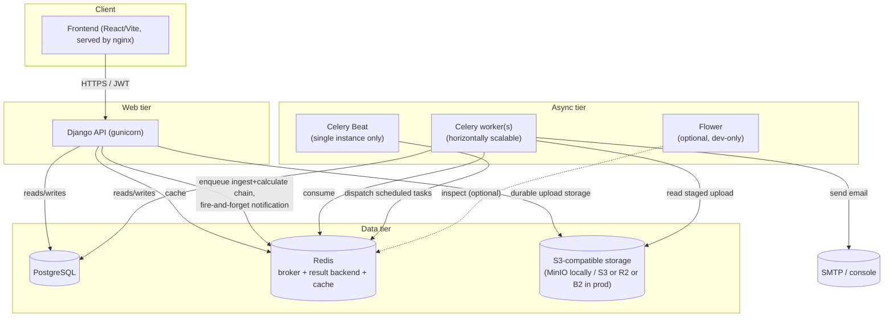
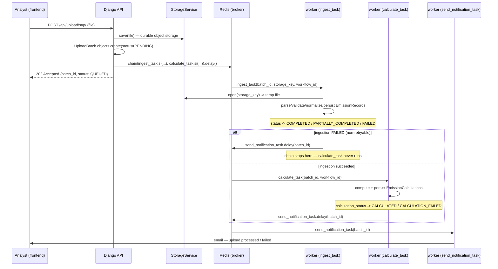
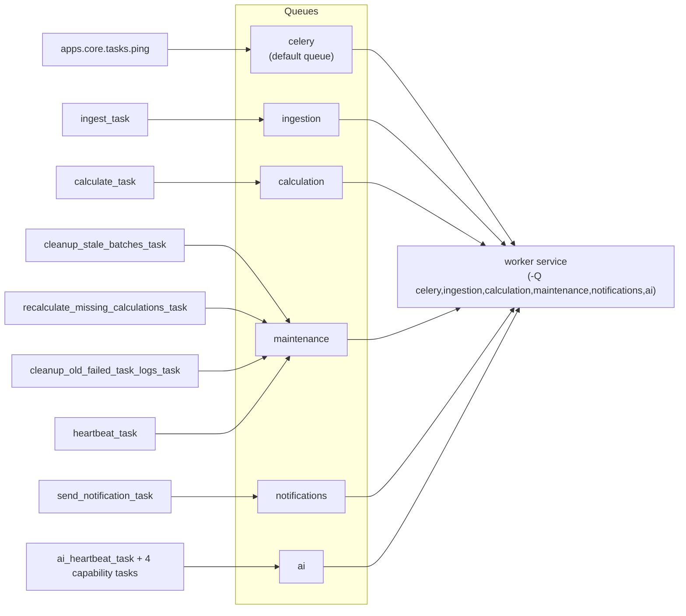

# System Architecture Overview (`ARCHITECTURE_OVERVIEW.md`)

Phase 5k — the single entry point for understanding how ScopeTrace fits
together end-to-end. This document is deliberately a map, not a re-derivation:
each subsystem already has an authoritative design doc (linked throughout),
and this file's job is to show how they connect, not repeat their contents.

Supersedes `ARCHITECTURE_INTEGRATION.md` (removed in this milestone) — that
document was a Phase 0-era "here's where each future feature will plug in"
plan; every seam it described is now fully implemented, and its per-feature
"status" annotations had drifted out of date across Phases 2–5j. This
document describes what actually exists today.

---

## 1. Component diagram

**Services, per `docker-compose.yml`:** `db` (PostgreSQL 16), `redis` (Redis
7), `minio` + `minio-init` (S3-compatible storage + one-shot bucket
creation), `api` (Django/gunicorn), `worker` (Celery), `beat` (Celery Beat,
single instance), `frontend` (React build served by nginx), and `flower`
(optional — `profiles: ["monitoring"]`, never starts by default). All seven
default services start on a plain `docker compose up --build`; see
[`DEPLOYMENT_GUIDE.md`](DEPLOYMENT_GUIDE.md).

---

## 2. Upload → ingest → calculate → notify (the core async pipeline)

`workflow_id` (stable, set once at batch creation) correlates every log
line across `ingest_task`, `calculate_task`, and `send_notification_task`
for one upload, despite each having its own, different Celery task id. Full
state-machine detail: [`JOB_LIFECYCLE.md`](JOB_LIFECYCLE.md). Retry/backoff
policy and the Dead Letter Queue: [`RETRY_DLQ.md`](RETRY_DLQ.md).
Notification design: [`NOTIFICATIONS.md`](NOTIFICATIONS.md).

---

## 3. Queue topology

One worker service consumes all six queues today (`docker-compose.yml`'s
`worker.command`) — the separation is a **routing seam**, not a behavior
change: a future deployment can dedicate a worker pool to any one queue
(e.g. `calculation` once AI enrichment makes it meaningfully slower) by
adding a `-Q <queue>` worker service, with zero code change. Each queue's
tasks, retry policy, and rationale: [`RETRY_DLQ.md`](RETRY_DLQ.md)
(ingestion/calculation), [`SCHEDULED_TASKS.md`](SCHEDULED_TASKS.md)
(maintenance), [`NOTIFICATIONS.md`](NOTIFICATIONS.md) (notifications).

---

## 4. Domain subsystems (link out, don't repeat)

| Subsystem | Authoritative doc | One-line summary |
|---|---|---|
| Data model / multi-tenancy | [`MODEL.md`](MODEL.md) | Every domain model carries an `organization` FK; schema/lineage/validation states |
| Authentication / RBAC / tenancy | [`AUTH_RBAC.md`](AUTH_RBAC.md) | JWT (access/refresh, rotation, blacklist), four org-scoped roles + Platform Admin, server-side tenant scoping |
| Ingestion source formats | [`SOURCES.md`](SOURCES.md) | SAP Fuel (CSV), Utility Electricity (CSV), Corporate Travel (JSON) — field-level realities and parsing limitations |
| Carbon Intelligence Engine | [`CARBON_ENGINE_DESIGN.md`](CARBON_ENGINE_DESIGN.md) | Versioned/provenance-tracked emission factors, effective-dated + specificity-ranked resolution, Decimal-precise factor-pinned CO₂e, explainability trace |
| Metrics / analytics / dashboards | [`METRICS_ANALYTICS.md`](METRICS_ANALYTICS.md) | Cached tenant-scoped aggregation API, pagination, streaming export, role-aware widget dashboard |
| Governance, audit & compliance (Phase 6) | [`GOVERNANCE.md`](GOVERNANCE.md) | Hash-chained audit trail, immutable record versioning, fixed approval workflow, on-demand compliance reports, reversible soft delete — see its own Governance Architecture Overview for the lifecycle diagram and how the eight systems fit together |
| AI Foundation (Phase 7a) | [`AI_ARCHITECTURE.md`](AI_ARCHITECTURE.md) | Provider-agnostic LLM gateway (single enforcement choke point), schema-enforced responses, per-tenant policy/budget/egress, full call-reproducibility audit trail — advisory-only, no code path can mutate governed data |
| AI Evaluation Infrastructure (Phase 7a.5) | [`AI_EVALUATION.md`](AI_EVALUATION.md) | Golden datasets + automatic prompt-regression detection, deterministic replay providers, a formal I1–I6 invariant merge gate, a two-tier CI split (deterministic blocking / LLM-judge advisory) — no AI feature implemented, only the harness every future capability milestone must pass |
| Job lifecycle (ingest+calculate chain) | [`JOB_LIFECYCLE.md`](JOB_LIFECYCLE.md) | `UploadBatch` state machine, two independent status axes, progress polling API |
| Retry / backoff / Dead Letter Queue | [`RETRY_DLQ.md`](RETRY_DLQ.md) | Independent per-task retry policies, `transient_exceptions` idempotency mechanism, DB-logged DLQ |
| Scheduled maintenance (Celery Beat) | [`SCHEDULED_TASKS.md`](SCHEDULED_TASKS.md) | Static code-defined schedule, stale-batch backstop, DLQ retention, recalculation safety net, heartbeat |
| Email notifications | [`NOTIFICATIONS.md`](NOTIFICATIONS.md) | Thin wrapper over Django's `EMAIL_BACKEND`, fire-and-forget dispatch task |
| Monitoring (Flower) | [`FLOWER.md`](FLOWER.md) | Optional, dev-only Celery monitoring UI |
| Docker images | [`DOCKER.md`](DOCKER.md) | Multi-stage backend build, explicit COPY allow-list |
| CI/CD | [`CI_CD.md`](CI_CD.md) | GitHub Actions — backend/frontend/Docker verification, caching, advisory security scanning |
| Design decisions & trade-offs | [`DECISIONS.md`](DECISIONS.md), [`TRADEOFFS.md`](TRADEOFFS.md) | Architectural patterns chosen and deliberately deferred scope |

**Operational documentation** (Phase 5k): local/production
deployment and environment variables
([`DEPLOYMENT_GUIDE.md`](DEPLOYMENT_GUIDE.md)); day-2 operations, health
checks, and runbooks
([`OPERATIONS_RUNBOOK.md`](OPERATIONS_RUNBOOK.md)); backup, disaster
recovery, incident response, and troubleshooting
([`INCIDENT_RESPONSE.md`](INCIDENT_RESPONSE.md)); application-level security
posture ([`SECURITY.md`](SECURITY.md)); infrastructure/platform-level
security recommendations, deliberately kept separate from application code
([`INFRASTRUCTURE_SECURITY.md`](INFRASTRUCTURE_SECURITY.md), Phase 6f);
known limitations and what's next ([`ROADMAP.md`](ROADMAP.md)).

**Architecture decision records** (`docs/adr/`, Phase 6 onward): significant
design decisions with real alternatives, each as its own numbered file
(context / alternatives / decision / consequences) rather than folded into
prose — e.g. why the approval workflow reuses one status field instead of
adding a second one, why compliance reports are generated on demand rather
than persisted, why soft-delete uses orthogonal fields rather than another
workflow status. Referenced from [`GOVERNANCE.md`](GOVERNANCE.md) at the
point each decision is relevant, not re-derived there.

---

## 5. Two independent status axes (the one cross-cutting concept worth restating here)

`UploadBatch.status` (ingestion outcome: `PENDING → QUEUED → PROCESSING →
COMPLETED/PARTIALLY_COMPLETED/FAILED`) and `UploadBatch.calculation_status`
(`NOT_STARTED → CALCULATING → CALCULATED/CALCULATION_FAILED`) are
deliberately separate — a calculation crash must never misrepresent a
successful ingestion, and vice versa. Nearly every operational surface in
this system (the DLQ, the stale-batch sweep, the notification dispatch
logic, the progress API) is built around this same two-axis model. Full
rationale: [`JOB_LIFECYCLE.md`](JOB_LIFECYCLE.md) §0.
