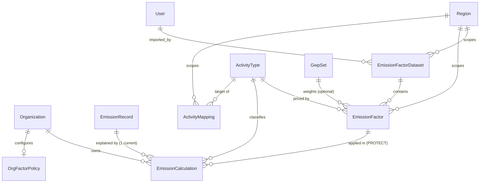
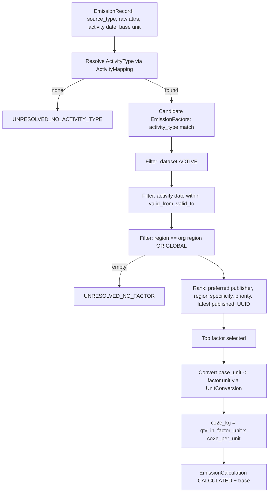

# ScopeTrace Carbon Intelligence Engine — Design (`CARBON_ENGINE_DESIGN.md`)

Phase 3 turns ScopeTrace from an ESG **ingestion** platform into a **carbon
accounting** platform. It computes auditable, reproducible CO₂e from activity
data using versioned, provenance-tracked emission factors.

This document is the authoritative design and is kept in sync with the code.

---

## 1. Principles

1. **Separation of concerns** — Activity Data · Emission Factors · Calculations · Reporting are independent layers with independent change cadence.
2. **Reproducibility** — a calculation *pins* the exact factor version it used and stores an explainable trace. Historical reports never drift when new factors are published.
3. **Provenance** — every factor dataset permanently records where it came from, who imported it, and a checksum. Datasets are append-only; corrections are new versions.
4. **Explainability** — every calculation carries a self-contained breakdown (activity → factor → formula → result) renderable without recomputation.
5. **Decimal everywhere** — no floats in the money/regulatory path.
6. **Extensible & AI-ready** — new publishers/regions/activity types are data, not code; the calculation service is a staged pipeline with reserved hook points for future AI stages.
7. **Scale** — designed for 1M+ records: bulk operations, no N+1, documented indexes.

---

## 2. Layered architecture

```
 ┌───────────────────────── Activity Data (existing) ──────────────────────────┐
 │  EmissionRecord: normalized_value + normalized_unit + scope_category         │
 └──────────────────────────────────────────────────────────────────────────────┘
                                     │ (activity + date + source)
                                     ▼
 ┌───────────────────────── Reference Data (global, shared) ───────────────────┐
 │  ActivityType   EmissionFactorDataset   EmissionFactor   UnitConversion       │
 │  Region         GwpSet (inert seam)     ActivityMapping                       │
 └──────────────────────────────────────────────────────────────────────────────┘
                                     │ (resolve type → factor → convert)
                                     ▼
 ┌───────────── Carbon Calculation Service (staged pipeline) ──────────────────┐
 │  RuleEngine → FactorResolution → [AIRecommendation*] → Calculation →          │
 │                                            [Optimization*]                     │
 │  (* reserved inert hooks — no AI implemented in Phase 3)                       │
 └──────────────────────────────────────────────────────────────────────────────┘
                                     │ (immutable, factor-pinned, explainable)
                                     ▼
 ┌───────────────────────── EmissionCalculation (tenant-scoped) ───────────────┐
 │  co2e_kg · co2e_tonnes · factor snapshot · calculation_trace · is_current     │
 └──────────────────────────────────────────────────────────────────────────────┘
                                     │
                                     ▼   Reporting / Metrics API → Phase 4
```

---

## 3. Entity–relationship diagram



Reference tables (`ActivityType`, `EmissionFactorDataset`, `EmissionFactor`,
`UnitConversion`, `Region`, `GwpSet`, `ActivityMapping`) carry **no** tenant FK —
they are shared, published science. `EmissionCalculation` and `OrgFactorPolicy`
are **tenant-scoped**.

---

## 4. Models

### 4.1 Region
Resolution geography. `code` (ISO-3166 / `GLOBAL` / `EU`), `name`, `parent` (self-FK, nullable) for a specificity hierarchy (EU → GB).

### 4.2 EmissionFactorDataset — the versioning + provenance unit
| Field | Purpose |
| :--- | :--- |
| `publisher` | DEFRA / EPA / IPCC / COUNTRY / CUSTOM |
| `name`, `version` | e.g. "UK Government GHG Conversion Factors", "2024.1" |
| `region` (FK, nullable) | scope of the dataset |
| `status` | DRAFT / ACTIVE / ARCHIVED / SUPERSEDED |
| `valid_from`, `valid_to` | effective window for its factors |
| **`publication_date`** | when the publisher released it |
| **`import_timestamp`** | when ScopeTrace imported it (`auto_now_add`) |
| **`checksum`** | sha256 of the source payload (provenance / dedupe) |
| **`source_filename`** | original file name imported |
| **`source_url`** | canonical source |
| **`imported_by`** (FK User) | who imported it |
| **`import_notes`** | free-text provenance notes |
| `priority` | resolution tie-breaker |
Unique `(publisher, version, region)`. **Immutable once ACTIVE** — enforced in `clean()`; only `status` may transition. Nothing overwrites a prior dataset; corrections are new versions.

### 4.3 ActivityType — controlled vocabulary
`code` (e.g. `DIESEL_STATIONARY`, `GRID_ELECTRICITY`, `FLIGHT_SHORT_HAUL_BUSINESS`), `name`, `default_scope`, `base_unit`, `gas_basis`, `description`. Decouples parsers from factors — the stable join key.

### 4.4 EmissionFactor — the number
`dataset` FK, `activity_type` FK, `region` FK (nullable → inherits dataset/global), `unit` (per-unit), `co2e_per_unit` `Decimal(30,12)`, per-gas seam `co2_per_unit`/`ch4_per_unit`/`n2o_per_unit` (nullable), `gwp_set` FK (nullable), `valid_from`/`valid_to` (nullable → inherit dataset), `methodology`, `uncertainty_pct`, `source_ref`. Unique `(dataset, activity_type, unit, region, valid_from)`.

### 4.5 UnitConversion
`from_unit`, `to_unit`, `dimension` (VOLUME/ENERGY/DISTANCE/MASS), `factor` `Decimal(30,12)`. Dimension-checked; supersedes the hardcoded conversion dicts.

### 4.6 GwpSet (inert seam)
`name` (AR5/AR6), `gwp_co2`, `gwp_ch4`, `gwp_n2o`, `source`. Designed for future per-gas CO₂e; **unused in Phase 3**.

### 4.7 OrgFactorPolicy (tenant)
`organization` O2O, `preferred_publisher`, `default_region` FK, `strict_mode` (fail vs. fall back to global).

### 4.8 ActivityMapping
`data_source_type` + optional `match_key` → `activity_type` (+ region). How ingestion classifies a row. Unique `(data_source_type, match_key)`.

### 4.9 EmissionCalculation — immutable, explainable, factor-pinned
`organization` FK (tenant), `emission_record` FK, `is_current`, `activity_type` FK (nullable), `emission_factor` FK (**PROTECT**, nullable when unresolved), **snapshot** (`factor_publisher`, `factor_version`, `factor_value`, `factor_unit`, `activity_quantity`, `activity_unit`), `co2e_kg` `Decimal(20,6)`, `co2e_tonnes` `Decimal(20,9)`, `gas_breakdown` JSON, **`calculation_trace` JSON** (explainability), `resolution_status`, `engine_version`, `calculated_at`. CO₂e lives **only** here (never on `EmissionRecord`) — this keeps the approval lock intact (see §11).

---

## 5. Factor resolution flow



**Determinism:** the ranking is a total order (final tie-break on factor UUID), so the same inputs always select the same factor.

---

## 6. Calculation lifecycle

```mermaid
sequenceDiagram
    participant Ing as IngestionService
    participant Calc as CarbonCalculationService
    participant DB as Database
    Ing->>Ing: parse + validate + normalize (activity data)
    Ing->>Calc: calculate_for_records(records)  %% non-FAILED only
    Calc->>Calc: RuleEngine -> FactorResolution -> [AI hook] -> Calculation -> [Optimization hook]
    Calc->>DB: bulk_create EmissionCalculation (is_current=True)
    Note over Calc,DB: FAILED -> EXCLUDED_FAILED; no factor -> UNRESOLVED_NO_FACTOR
    Ing->>DB: commit batch (activity + calculations together)
```

States: `CALCULATED`, `UNRESOLVED_NO_FACTOR`, `UNRESOLVED_NO_ACTIVITY_TYPE`,
`EXCLUDED_FAILED`. **Recalculation** (new dataset activates / correction) is an
explicit, audited batch: it creates a new calculation and flips the previous
`is_current=False`. **Approved records freeze** to their pinned factor; a
re-baseline is an explicit Org-Admin action that never mutates the locked record.

---

## 7. Explainability

Each calculation stores `calculation_trace` — a self-contained, ordered breakdown
the frontend renders directly (no recomputation):

```json
{
  "steps": [
    {"label": "Activity",   "value": "1200 L Diesel"},
    {"label": "Factor",     "value": "2.68 kgCO₂e/L", "source": "DEFRA 2024"},
    {"label": "Formula",    "value": "1200 × 2.68"},
    {"label": "Result",     "value": "3216 kgCO₂e"},
    {"label": "Normalized", "value": "3.216 tCO₂e"}
  ],
  "activity_quantity": "1200", "activity_unit": "L",
  "factor_value": "2.68", "factor_unit": "kgCO2e/L",
  "co2e_kg": "3216.000000", "co2e_tonnes": "3.216000000"
}
```

---

## 8. AI-ready pipeline

`CarbonCalculationService` runs an ordered list of `CalculationStage`s over a
mutable `CalculationContext`:

```
RuleEngineStage → FactorResolutionStage → AIRecommendationStage(noop)
    → CalculationStage → OptimizationStage(noop)
```

- **RuleEngineStage** — deterministic pre-rules (e.g. exclusions).
- **FactorResolutionStage** — §5.
- **AIRecommendationStage** — reserved hook; Phase 3 is a pass-through that may attach `context.recommendations` (empty). Future: suggest a better factor / flag anomalies.
- **CalculationStage** — the Decimal math + trace.
- **OptimizationStage** — reserved hook; future: reduction suggestions.

Stages are swappable/insertable without touching existing stages — new AI
modules register a stage; **no AI is implemented in Phase 3.**

---

## 9. Precision

`Decimal` end-to-end via `apps/carbon/precision.py`. Factor `Decimal(30,12)`;
`co2e_kg` `Decimal(20,6)`; `co2e_tonnes` `Decimal(20,9)`. Full precision is
carried through convert × multiply; `quantize(ROUND_HALF_UP)` is applied **only**
at the storage boundary. Golden-value tests lock exact outputs.

---

## 10. Performance (1M+ records)

- **Bulk**: calculations created via `bulk_create`; resolution pre-loads factors once per batch (a `FactorIndex` cache keyed by activity_type/region/date), avoiding a query per row.
- **No N+1**: reads use `select_related('emission_factor','activity_type')`; the record serializer joins the current calculation via `Prefetch`, never a query-in-loop.
- **Indexes (documented):**

| Table | Index | Rationale |
| :--- | :--- | :--- |
| EmissionCalculation | `(organization, is_current)` | tenant list of live calcs |
| EmissionCalculation | partial unique `(emission_record) WHERE is_current` | one current calc per record |
| EmissionCalculation | `(emission_record, is_current)` | record → current calc join |
| EmissionCalculation | `(organization, resolution_status)` | dashboards / unresolved review |
| EmissionCalculation | `(organization, activity_type)` | per-activity aggregation (Phase 4) |
| EmissionFactor | `(activity_type, region)` | resolution candidate lookup |
| EmissionFactor | `(dataset)` | dataset factor listing |
| EmissionFactor | `(activity_type, valid_from, valid_to)` | effective-dated resolution |
| EmissionFactorDataset | `(publisher, status)` | active dataset lookup |
| ActivityMapping | unique `(data_source_type, match_key)` | classification lookup |

---

## 11. Migration & transition

- Additive only; new `apps.carbon` tables. `EmissionFactor.on_delete=PROTECT` from calculations.
- **No CO₂e column on `EmissionRecord`** — `EmissionCalculation` is the sole source of truth. Rationale: `EmissionRecord.clean()` blocks all saves on `APPROVED` records, so writing CO₂e to the record is impossible for locked rows; a separate table sidesteps this and keeps the audit lock meaningful.
- **`backfill_calculations`** management command computes calculations for existing non-FAILED records (idempotent), never mutating locked records. Unresolved rows are surfaced for an analyst to add mappings/factors, then re-run.
- **Deploy order:** `migrate` → `import_emission_factors` (seed DEFRA) → `backfill_calculations` → deploy API/frontend.

---

## 12. Testing strategy

Golden-value regression · precision · versioning/effective-dating · unit
conversion (incl. cross-dimension rejection) · dataset activation/supersede ·
backfill · recalculation (+ approved-record freeze) · explainability (trace
shape/content) · tenant isolation of calculations · RBAC (import = Platform
Admin, recalc = Org Admin). Golden fixtures committed as regression locks.

---

## 13. API surface

| Method | Endpoint | Auth | Notes |
| :--- | :--- | :--- | :--- |
| GET | `/api/activity-types/` | member | reference (global read) |
| GET | `/api/factor-datasets/` | member | provenance visible; filter publisher/status |
| GET | `/api/emission-factors/` | member | filter activity_type/region/date |
| GET | `/api/calculations/` | member | **tenant-scoped**; filter scope/status |
| POST | `/api/records/{id}/recalculate/` | Org Admin | audited; respects approval freeze |
| — | `import_emission_factors` (mgmt cmd) | Platform Admin | idempotent import + activate |

`EmissionRecordSerializer` gains read-only `co2e_kg`, `co2e_tonnes`,
`calculation_status`, `factor_provenance`, and `calculation_trace` sourced from
the current calculation.

---

## 14. Frontend impact (additive, no redesign)

Review Ledger gains a real **CO₂e (t)** column and a detail-drawer
**breakdown + provenance** panel driven by `calculation_trace`; an
`UNRESOLVED` badge flags records missing a factor. Dashboard emission tiles
become real (simple sums now; rich aggregation in Phase 4).

---

## 15. Implementation note — flight seat-class multiplier (deferred relocation)

The original design (§8) proposed relocating the DEFRA seat-class multiplier out
of `NormalizationService._normalize_travel` into the factor layer. During
implementation this was found to change stored `normalized_value` for flights
(class-weighted km → physical km), which would **split activity-data semantics
between legacy and new records** and make backfill inconsistent without a
data migration of every existing flight record.

**Decision:** the class multiplier remains applied at normalization (consistent
old and new records); the factor layer holds a generic per-km flight factor. CO₂e
is therefore `physical_km × class_multiplier × per_km_factor`. This is an explicit,
tested methodology — locked by the `test_flight_class_weighting_parity`
end-to-end test. A future migration-aware task can move class handling into
class-specific `ActivityType`s / factors if desired.
