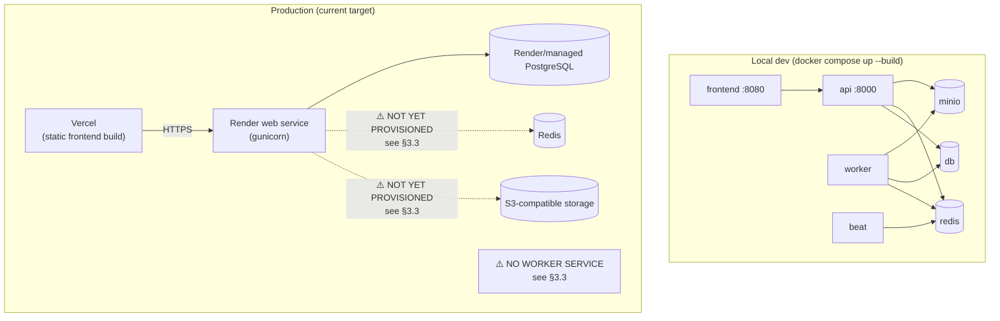

# Deployment Guide (`DEPLOYMENT_GUIDE.md`)

Phase 5k. Covers local development, production deployment, the full
environment variable reference, Docker/Compose usage, and the release
checklist. See [`ARCHITECTURE_OVERVIEW.md`](ARCHITECTURE_OVERVIEW.md) first
if you haven't — this guide assumes you know what the services are, not
just how to start them.

---

## 1. Deployment topology



Local development and Docker Compose fully exercise the real Phase 5
architecture (Redis, S3-compatible storage via MinIO, worker, beat) — this
is the environment every milestone in this project has been verified
against. **Production (`render.yaml`) does not yet match it** — see §3.3,
a load-bearing gap this guide documents honestly rather than pretending it
already works.

---

## 2. Local Development Guide

### 2.1 Docker Compose (recommended — exercises the real architecture)

```bash
docker compose up --build
```

Brings up seven services: `db` (PostgreSQL 16), `redis` (Redis 7), `minio`
+ `minio-init` (S3-compatible storage), `api` (Django/gunicorn, `DEBUG=False`
to mirror production config), `worker` (Celery), `beat` (Celery Beat), and
`frontend` (built React app served by nginx). On first start, `api`
automatically runs migrations, collects static files, and seeds baseline
data (`bootstrap_data` + `seed_carbon`) — the stack is immediately usable.

| Service | URL |
|---|---|
| Frontend | http://localhost:8080 |
| API (browsable) | http://localhost:8000/api/ |
| Health check | http://localhost:8000/healthz |
| Worker health check | http://localhost:8000/healthz/worker/ |
| Django Admin | http://localhost:8000/admin/ (`admin` / `admin12345` by default) |
| MinIO console | http://localhost:9001 (`scopetrace` / `scopetrace123` by default) |

Demo users (also seeded by default): `orgadmin` / `analyst` / `auditor` /
`viewer`, password `demo12345` — one per role, in the demo organization.

```bash
docker compose down          # stop, keep the pgdata/miniodata/beatdata volumes
docker compose down -v       # stop and delete all volumes (fresh start)
docker compose up --scale worker=3 -d   # horizontal worker scaling, zero code change
```

**Flower** (Celery monitoring UI) is optional and does **not** start by
default:

```bash
docker compose --profile monitoring up -d flower
```

→ http://localhost:5555 (`scopetrace` / `scopetrace123` by default). See
[`FLOWER.md`](FLOWER.md).

### 2.2 Without Docker (backend only, fast iteration)

```bash
cd backend
python -m venv venv && source venv/bin/activate   # .\venv\Scripts\activate on Windows
pip install -r requirements.txt
python manage.py migrate
python manage.py bootstrap_data --demo-users
python manage.py runserver
```

With no `DATABASE_URL` set, `DEBUG=True` (the default for local dev)
transparently falls back to SQLite — no Postgres needed for quick backend
iteration. With no `REDIS_URL` set, `CELERY_TASK_ALWAYS_EAGER` defaults to
`True` under `DEBUG` — uploads still fully process (ingest → calculate →
notify) **synchronously inline**, no worker process needed either. This is
genuinely useful for fast iteration, but it does NOT exercise the real
async/queue architecture — use Docker Compose (§2.1) whenever you're
touching Celery tasks, retry policies, or anything queue-related.

```bash
cd frontend
npm install
npm run dev   # http://localhost:5173
```

### 2.3 Running tests

```bash
cd backend
python manage.py test --verbosity 2
```

Always runs with `CELERY_TASK_ALWAYS_EAGER=True` (forced under `_TESTING`,
independent of `DEBUG`) — no live broker needed. See
[`CI_CD.md`](CI_CD.md) for how this differs in GitHub Actions (real
Postgres + Redis service containers).

```bash
cd frontend
npm run build   # also the CI gate — there is no frontend test suite yet, see docs/ROADMAP.md
npm run lint
```

---

## 3. Production Deployment Guide

### 3.1 Current architecture (documented, per `render.yaml` + Vercel)

- **Frontend**: static build deployed to Vercel, `VITE_API_URL` pointed at
  the Render API.
- **Backend API**: Render web service (`runtime: python`, `rootDir:
  backend`), `gunicorn config.wsgi:application`, health-checked at
  `/healthz`.
- **Database**: Render-managed PostgreSQL (`render.yaml`'s `databases:`
  block).

### 3.2 Release flow (`render.yaml`)

```
buildCommand:   pip install -r requirements.txt && collectstatic
releaseCommand: migrate && bootstrap_data && seed_carbon   (idempotent — safe on every deploy)
startCommand:   gunicorn config.wsgi:application --bind 0.0.0.0:$PORT --workers 2 --timeout 120
```

`bootstrap_data`/`seed_carbon` are both idempotent (checked in their own
management commands — `bootstrap_data` only creates what's missing;
`seed_carbon`/`import_emission_factors` dedupe by publisher+version+
checksum), so re-running them on every release is safe and is what keeps a
fresh database immediately usable.

### 3.3 ⚠️ Known gap: `render.yaml` predates Phase 5 and will not run this codebase correctly

Found while writing this guide, not previously documented anywhere:
`render.yaml` has not been updated since early in the project (its
`envVars:` list still matches roughly Phase 2's shape) and is missing
everything Phase 5 added. Concretely, deploying today's code with today's
`render.yaml`, unchanged, would:

1. **Fail to boot at all.** `STORAGE_BACKEND` fails closed to `'s3'`
   whenever `DEBUG=False` (`config/settings.py`) — `render.yaml` sets
   `DEBUG: "False"` but defines no `STORAGE_BACKEND` or any `AWS_S3_*`
   variable, so Django raises `ImproperlyConfigured` at settings-import
   time, before the process can even start serving requests.
2. **Have no Redis** — no service block provisions one, and no
   `REDIS_URL` is set. Without it, `CELERY_BROKER_URL`/`CELERY_RESULT_BACKEND`
   are empty and Celery has no broker to dispatch to.
3. **Have no worker or beat service at all.** Even if (1) and (2) were
   fixed, uploads would be accepted (`202 Accepted`, `status: QUEUED`) and
   then sit in the queue forever — nothing would ever consume `ingestion`/
   `calculation`/`maintenance`/`notifications` messages in production.

This is flagged as a **Critical** finding in this milestone's Production
Readiness Review (see the end of this milestone's implementation report)
rather than silently fixed as a side effect of a documentation milestone —
render.yaml changes affect real deployment/secrets and deserve their own
explicit, deliberate pass. What a corrected `render.yaml` needs to add, so
this guide states the target accurately rather than aspirationally:

- A Redis instance (Render's managed Key Value/Redis offering, or an
  external one) and `REDIS_URL` wired to both `api` and the new services
  below.
- An S3-compatible bucket (Cloudflare R2 / Backblaze B2 / AWS S3) and
  `STORAGE_BACKEND=s3` + `AWS_ACCESS_KEY_ID`/`AWS_SECRET_ACCESS_KEY`/
  `AWS_STORAGE_BUCKET_NAME`/`AWS_S3_REGION_NAME`/`AWS_S3_ENDPOINT_URL`/
  `AWS_S3_ADDRESSING_STYLE` set accordingly (§4 has the full reference).
- A `type: worker` background service running
  `celery -A config worker --loglevel=info -Q celery,ingestion,calculation,maintenance,notifications`,
  `RUN_MIGRATIONS=false` (mirrors `docker-compose.yml`'s `worker`).
- A second `type: worker` service for Beat:
  `celery -A config beat --loglevel=info --schedule=/opt/render/project/beat-data/celerybeat-schedule`
  (or an ephemeral schedule path — Beat is single-instance only, see
  [`SCHEDULED_TASKS.md`](SCHEDULED_TASKS.md); Render's persistent disks
  would be needed for the schedule file to survive restarts, though every
  scheduled task is idempotent/self-healing so losing that bookkeeping on
  restart is a minor inefficiency, not a correctness risk).
- Optionally, `EMAIL_HOST`/`EMAIL_PORT`/`EMAIL_HOST_USER`/
  `EMAIL_HOST_PASSWORD` for real outbound notification email (defaults to
  the console backend — notifications are logged, not delivered, until
  this is set; see [`NOTIFICATIONS.md`](NOTIFICATIONS.md)).

### 3.4 What already works today, unaffected by §3.3

The web tier alone (API + DB + frontend, no async processing) — read-only
browsing, authentication, the Metrics API, Django Admin — would function.
Anything that depends on the async pipeline (file upload processing,
scheduled maintenance, email notifications) will not, until §3.3 is
addressed.

---

## 4. Environment Variables Reference

All read via `python-decouple`'s `config(...)` (backend) — every variable
below has a `default=` in `config/settings.py` unless marked **required**.
Booleans accept `True`/`False` (case-insensitive); lists are comma-separated.

### 4.1 Core / security (fails closed when `DEBUG=False`)

| Variable | Default | Notes |
|---|---|---|
| `DEBUG` | `False` | `True` only for local dev. Gates several other fail-closed checks below. |
| `SECRET_KEY` | *(none)* | **Required when `DEBUG=False`.** Insecure dev key used automatically when `DEBUG=True`. |
| `ALLOWED_HOSTS` | `localhost,127.0.0.1` | Comma-separated. `*` rejected when `DEBUG=False`. |
| `DATABASE_URL` | *(none)* | **Required when `DEBUG=False`.** SQLite fallback (`db.sqlite3`) when blank and `DEBUG=True`. |
| `CORS_ALLOW_ALL_ORIGINS` | `False` | |
| `CORS_ALLOWED_ORIGINS` | *(empty)* | Comma-separated. |
| `CSRF_TRUSTED_ORIGINS` | *(empty)* | Comma-separated. |
| `SECURE_SSL_REDIRECT` | `True` (when `DEBUG=False`) | Set `False` for plain-HTTP Compose/local prod-mirroring. |
| `SESSION_COOKIE_SECURE` | `True` (when `DEBUG=False`) | Same. |
| `CSRF_COOKIE_SECURE` | `True` (when `DEBUG=False`) | Same. |
| `SECURE_HSTS_SECONDS` | `31536000` (when `DEBUG=False`) | |

### 4.2 Auth (JWT) / throttling

| Variable | Default | Notes |
|---|---|---|
| `JWT_ACCESS_MINUTES` | `15` | Access token lifetime. |
| `JWT_REFRESH_DAYS` | `7` | Refresh token lifetime (rotated + blacklisted on use/logout). |
| `THROTTLE_ANON` | `100/hour` | DRF anon-scope rate. Disabled under the test runner. |
| `THROTTLE_USER` | `2000/hour` | DRF authenticated-scope rate. |
| `THROTTLE_LOGIN` | `10/min` | Login endpoint specifically. |

### 4.3 Database / bootstrap seeding

| Variable | Default | Notes |
|---|---|---|
| `DJANGO_SUPERUSER_USERNAME` | `admin` | Read by `bootstrap_data`. |
| `DJANGO_SUPERUSER_EMAIL` | `admin@scopetrace.local` | |
| `DJANGO_SUPERUSER_PASSWORD` | *(none)* | Admin only created if set; insecure dev default used under `DEBUG=True` if unset. |
| `BOOTSTRAP_DATA` | `false` | Entrypoint flag — seeds org/datasources/admin on container start. |
| `BOOTSTRAP_DEMO_USERS` | `false` | Also seeds one demo user per role. |
| `DEMO_USER_PASSWORD` | `demo12345` | |

### 4.4 Redis / Celery

| Variable | Default | Notes |
|---|---|---|
| `REDIS_URL` | *(empty)* | Django cache backend AND Celery broker/result-backend default. Unset = local-memory cache + forced eager Celery. |
| `CELERY_BROKER_URL` | `REDIS_URL` | Only set if it should differ from `REDIS_URL`. |
| `CELERY_RESULT_BACKEND` | `REDIS_URL` | Same. |
| `CELERY_TASK_ALWAYS_EAGER` | `DEBUG or _TESTING` | Set explicitly `False` to force real async dispatch even under `DEBUG`. |
| `CELERY_TASK_DEFAULT_QUEUE` | `celery` | |
| `STALE_BATCH_THRESHOLD_MINUTES` | `30` | `cleanup_stale_batches_task`'s staleness window — see [`SCHEDULED_TASKS.md`](SCHEDULED_TASKS.md). |
| `FAILED_TASK_LOG_RETENTION_DAYS` | `90` | DLQ audit-log retention — see [`RETRY_DLQ.md`](RETRY_DLQ.md). |
| `CELERY_HEARTBEAT_TTL_SECONDS` | `180` | Beat heartbeat cache TTL. |

### 4.5 Durable storage (`StorageService`)

| Variable | Default | Notes |
|---|---|---|
| `STORAGE_BACKEND` | `local` if `DEBUG=True`, else *(none, fails closed)* | **Required `'s3'` when `DEBUG=False`.** |
| `MEDIA_BASE_URL` | `http://localhost:8000` | Only used by the local filesystem provider, to build absolute download URLs. |
| `AWS_ACCESS_KEY_ID` / `AWS_SECRET_ACCESS_KEY` | *(empty)* | Required when `STORAGE_BACKEND=s3`. |
| `AWS_STORAGE_BUCKET_NAME` | *(empty)* | Required when `STORAGE_BACKEND=s3`. |
| `AWS_S3_REGION_NAME` | `auto` | |
| `AWS_S3_ENDPOINT_URL` | *(empty = real AWS S3)* | Set for R2/B2/MinIO, e.g. `http://minio:9000` in Compose. |
| `AWS_S3_ADDRESSING_STYLE` | `virtual` | `path` for MinIO. |
| `AWS_S3_URL_EXPIRE_SECONDS` | `3600` | Presigned download URL TTL. |

### 4.6 Email notifications

| Variable | Default | Notes |
|---|---|---|
| `EMAIL_HOST` | *(empty = console backend)* | Setting this switches to real SMTP. |
| `EMAIL_PORT` | `587` | Only read when `EMAIL_HOST` is set. |
| `EMAIL_HOST_USER` / `EMAIL_HOST_PASSWORD` | *(empty)* | Same. |
| `EMAIL_USE_TLS` | `True` | Same. |
| `EMAIL_TIMEOUT` | `10` | Seconds — always applied, regardless of backend. |
| `DEFAULT_FROM_EMAIL` | `noreply@scopetrace.local` | |

### 4.7 Logging

| Variable | Default | Notes |
|---|---|---|
| `LOG_LEVEL` | `INFO` | |
| `DJANGO_LOG_LEVEL` | `INFO` | Django's own logger specifically. |

### 4.8 Docker Compose-only (local infra credentials, not read by Django)

| Variable | Default | Notes |
|---|---|---|
| `POSTGRES_DB` / `POSTGRES_USER` / `POSTGRES_PASSWORD` | `scopetrace` / `scopetrace` / `scopetrace` | The `db` service's own credentials. |
| `MINIO_ROOT_USER` / `MINIO_ROOT_PASSWORD` | `scopetrace` / `scopetrace123` | The `minio` service's own credentials. |
| `STORAGE_BUCKET` | `scopetrace-uploads` | Bucket name `minio-init` creates. |
| `FLOWER_USER` / `FLOWER_PASSWORD` | `scopetrace` / `scopetrace123` | Flower's basic auth (`monitoring` profile only). |
| `VITE_API_URL` | `http://localhost:8000` | Baked into the frontend build at build time (Vite produces a static bundle). |

### 4.9 Declared but unused (technical debt — do not treat as real toggles)

`FEATURE_JWT_AUTH`, `FEATURE_ENFORCE_TENANT_SCOPE`, `FEATURE_EMISSION_FACTORS`
are still declared in `config/settings.py` but read nowhere else in the
codebase (confirmed by search) — Phases 2 and 3 implemented JWT auth, tenant
isolation, and the emission factor engine unconditionally rather than
behind a phased dark-launch flag. Setting these to anything has no effect.
Flagged as a cleanup candidate in this milestone's Production Readiness
Review, not removed here (a settings.py change is a code change, out of
scope for a documentation milestone).

---

## 5. Docker & Docker Compose Guide

See [`DOCKER.md`](DOCKER.md) for the multi-stage backend image's design
rationale (why an explicit COPY allow-list, the `HOME=/root` +
`chmod -R a+rX /root` fix for `pip install --user` under a non-root final
user). This section is the practical day-to-day usage reference.

```bash
docker compose up --build -d          # (re)build images, start everything, detached
docker compose up --scale worker=3 -d # horizontal worker scaling
docker compose --profile monitoring up -d flower   # optional Flower

docker compose ps                     # service status
docker compose logs -f worker         # follow one service's logs
docker compose logs --no-color api | grep ERROR

docker compose exec api python manage.py <command>   # run a management command
docker compose exec db psql -U scopetrace -d scopetrace   # direct DB shell

docker compose down                   # stop (keeps pgdata/miniodata/beatdata volumes)
docker compose down -v                # stop AND delete all volumes
```

**`beat` is a single-instance-only service** — never `docker compose up
--scale beat=N>1`; two Beat schedulers would each independently fire every
periodic task on its own timer, double-dispatching every scheduled job.
`worker` is the opposite: designed to scale freely, verified with zero code
changes up to at least 3 replicas.

---

## 6. Release Checklist

Before pushing a release-bound commit / opening a release PR:

- [ ] Full backend suite passes locally: `python manage.py test --verbosity 2`.
- [ ] `python manage.py makemigrations --check --dry-run` — no missing migrations.
- [ ] Frontend builds: `npm run build`; lints clean: `npm run lint` (0 errors — see [`CI_CD.md`](CI_CD.md)).
- [ ] All three GitHub Actions workflows green on the branch (Backend CI, Frontend CI, Docker Build Verification).
- [ ] `pip-audit`/`npm audit` output reviewed (advisory, non-blocking — see [`CI_CD.md`](CI_CD.md) §1.2) — no new *actionable* findings ignored.
- [ ] If any Celery task/queue/schedule changed: verified live against `docker compose up --build` (not just eager-mode unit tests) — several real bugs (queue misrouting, eager-mode signal limitations, Postgres-vs-SQLite formatting) have only ever surfaced this way.
- [ ] If any migration was added: confirmed it runs cleanly against a fresh `docker compose up --build` (not just the persistent dev DB).
- [ ] `CHANGELOG`/commit messages describe *why*, not just *what* (this repo's established convention throughout Phase 5).
- [ ] No secrets committed (`.env`, real `SECRET_KEY`/`AWS_*`/`EMAIL_HOST_PASSWORD` values) — `.gitignore`/`.dockerignore` both exclude `.env`.
- [ ] Never merge into `main` without explicit approval; push milestone branches only (this repo's standing workflow rule).

**Before actually deploying to Render** (separately from the above — a
distinct, higher-stakes action): confirm §3.3's gap has been addressed for
whatever this release needs (e.g. don't deploy an async-processing change
to a target that has no worker service yet).
