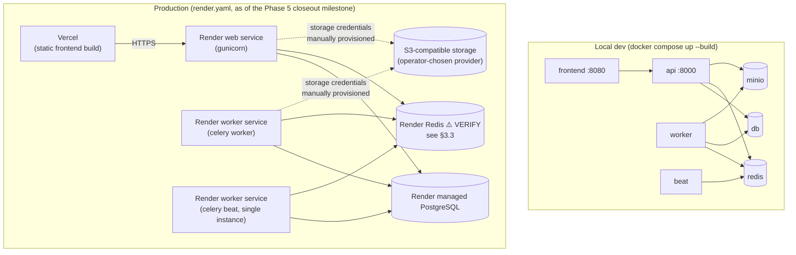

# Deployment Guide (`DEPLOYMENT_GUIDE.md`)

Phase 5k. Covers local development, production deployment, the full
environment variable reference, Docker/Compose usage, and the release
checklist. See [`ARCHITECTURE_OVERVIEW.md`](ARCHITECTURE_OVERVIEW.md) first
if you haven't — this guide assumes you know what the services are, not
just how to start them.

---

## 1. Deployment topology



Local development and Docker Compose fully exercise the real Phase 5
architecture (Redis, S3-compatible storage via MinIO, worker, beat) — this
is the environment every milestone in this project has been verified
against. **`render.yaml` now provisions the matching production topology**
(Redis, a worker service, a Beat service, and object-storage configuration)
as of the dedicated Phase 5 closeout milestone that follows 5k — see §3.3
for exactly what's high-confidence vs. what still needs verification against
Render's current platform before a real deploy (I have no Render deploy
access to test this file live).

---

## 2. Local Development Guide

### 2.1 Docker Compose (recommended — exercises the real architecture)

```bash
docker compose up --build
```

Brings up seven services: `db` (PostgreSQL 16), `redis` (Redis 7), `minio`
+ `minio-init` (S3-compatible storage), `api` (Django/gunicorn, `DEBUG=False`
to mirror production config), `worker` (Celery), `beat` (Celery Beat), and
`frontend` (built React app served by nginx). On first start, `api`
automatically runs migrations, collects static files, and seeds baseline
data (`bootstrap_data` + `seed_carbon`) — the stack is immediately usable.

| Service | URL |
|---|---|
| Frontend | http://localhost:8080 |
| API (browsable) | http://localhost:8000/api/ |
| Health check | http://localhost:8000/healthz |
| Worker health check | http://localhost:8000/healthz/worker/ |
| Django Admin | http://localhost:8000/admin/ (`admin` / `admin12345` by default) |
| MinIO console | http://localhost:9001 (`scopetrace` / `scopetrace123` by default) |

Demo users (also seeded by default): `orgadmin` / `analyst` / `auditor` /
`viewer`, password `demo12345` — one per role, in the demo organization.

```bash
docker compose down          # stop, keep the pgdata/miniodata/beatdata volumes
docker compose down -v       # stop and delete all volumes (fresh start)
docker compose up --scale worker=3 -d   # horizontal worker scaling, zero code change
```

**Flower** (Celery monitoring UI) is optional and does **not** start by
default:

```bash
docker compose --profile monitoring up -d flower
```

→ http://localhost:5555 (`scopetrace` / `scopetrace123` by default). See
[`FLOWER.md`](FLOWER.md).

### 2.2 Without Docker (backend only, fast iteration)

```bash
cd backend
python -m venv venv && source venv/bin/activate   # .\venv\Scripts\activate on Windows
pip install -r requirements.txt
python manage.py migrate
python manage.py bootstrap_data --demo-users
python manage.py runserver
```

With no `DATABASE_URL` set, `DEBUG=True` (the default for local dev)
transparently falls back to SQLite — no Postgres needed for quick backend
iteration. With no `REDIS_URL` set, `CELERY_TASK_ALWAYS_EAGER` defaults to
`True` under `DEBUG` — uploads still fully process (ingest → calculate →
notify) **synchronously inline**, no worker process needed either. This is
genuinely useful for fast iteration, but it does NOT exercise the real
async/queue architecture — use Docker Compose (§2.1) whenever you're
touching Celery tasks, retry policies, or anything queue-related.

```bash
cd frontend
npm install
npm run dev   # http://localhost:5173
```

### 2.3 Running tests

```bash
cd backend
python manage.py test --verbosity 2
```

Always runs with `CELERY_TASK_ALWAYS_EAGER=True` (forced under `_TESTING`,
independent of `DEBUG`) — no live broker needed. See
[`CI_CD.md`](CI_CD.md) for how this differs in GitHub Actions (real
Postgres + Redis service containers).

```bash
cd frontend
npm run build   # also the CI gate — there is no frontend test suite yet, see docs/ROADMAP.md
npm run lint
```

---

## 3. Production Deployment Guide

### 3.1 Current architecture (documented, per `render.yaml` + Vercel)

- **Frontend**: static build deployed to Vercel, `VITE_API_URL` pointed at
  the Render API.
- **Backend API**: Render web service (`runtime: python`, `rootDir:
  backend`), `gunicorn config.wsgi:application`, health-checked at
  `/healthz`.
- **Celery worker**: Render worker service, same codebase, `celery -A config
  worker -Q celery,ingestion,calculation,maintenance,notifications`.
- **Celery Beat**: a second Render worker service, single instance only,
  `celery -A config beat`.
- **Redis**: Render-managed instance — Celery broker/result-backend and the
  Django cache.
- **Database**: Render-managed PostgreSQL (`render.yaml`'s `databases:`
  block).
- **Object storage**: provider-configurable (AWS S3 / Cloudflare R2 /
  Backblaze B2 / any S3-compatible host) — credentials provisioned manually
  via the Render dashboard (`sync: false`), never committed. See §3.3.

### 3.2 Release flow (`render.yaml`)

```
buildCommand:   pip install -r requirements.txt && collectstatic
releaseCommand: migrate && bootstrap_data && seed_carbon   (idempotent — safe on every deploy)
startCommand:   gunicorn config.wsgi:application --bind 0.0.0.0:$PORT --workers 2 --timeout 120
```

`bootstrap_data`/`seed_carbon` are both idempotent (checked in their own
management commands — `bootstrap_data` only creates what's missing;
`seed_carbon`/`import_emission_factors` dedupe by publisher+version+
checksum), so re-running them on every release is safe and is what keeps a
fresh database immediately usable.

### 3.3 `render.yaml`'s alignment with Phase 5 — history and current status

**Originally found while writing this guide** (documented honestly, not
silently patched, as this milestone's own explicit instruction): `render.yaml`
had not been updated since early in the project (its `envVars:` list still
matched roughly Phase 2's shape) and was missing everything Phase 5 added —
deploying that version would have failed to even boot (`STORAGE_BACKEND`
fails closed to `'s3'` whenever `DEBUG=False`, and no `STORAGE_BACKEND`/
`AWS_S3_*`/Redis/worker/beat config existed at all). Flagged as **Critical**
in the Production Readiness Review that followed Milestone 5k, deliberately
**not** fixed as a side effect of that documentation-only milestone —
`render.yaml` changes affect real deployment/secrets and warranted their own
explicit, deliberate pass.

**That pass is this file's current state.** `render.yaml` now provisions:

- A Render `type: redis` managed instance, referenced by `api`/`worker`/
  `beat` via `fromService` (not copy-pasted).
- A `type: worker` service (`scopetrace-worker`) running
  `celery -A config worker -Q celery,ingestion,calculation,maintenance,notifications`.
- A second `type: worker` service (`scopetrace-beat`) running
  `celery -A config beat` — no `releaseCommand` on either (only `api` owns
  migrations/seeding), and deliberately no persistent disk for Beat's
  schedule file (Render's filesystem is ephemeral; losing that bookkeeping
  on restart is a minor inefficiency, not a correctness risk, since every
  scheduled task is idempotent/self-healing — see
  [`SCHEDULED_TASKS.md`](SCHEDULED_TASKS.md)).
- An `envVarGroups: [scopetrace-shared]` block holding `STORAGE_BACKEND` +
  the five `AWS_S3_*` variables (provider-configurable — the same five
  variables configure AWS S3, Cloudflare R2, Backblaze B2, or a
  self-hosted MinIO-compatible host; only their *values* differ per
  provider, documented inline in `render.yaml` itself) and the optional
  `EMAIL_*` variables, shared across `api`/`worker`/`beat` without
  duplicating the same `sync: false` secret three times.

**Two pieces of this file could not be verified against Render's live
platform** (no deploy access) and are marked `# VERIFY:` directly in
`render.yaml`: the `type: redis` service-type keyword itself (Render has
renamed this product before), and `fromService: {..., envVarKey:
SECRET_KEY}` for sharing one auto-generated `SECRET_KEY` across all three
Python services (needed so JWT/session signing is consistent across
processes — each service independently calling `generateValue: true` would
give them three *different* secrets). If either is rejected by Render's
blueprint validator, the documented fallback is to provision Redis manually
and paste its connection string as a `sync: false` secret on each service,
and to generate `SECRET_KEY` once and paste the identical value into all
three services' dashboards — functionally equivalent, just not expressed
as IaC.

**Object storage is explicitly not something Render's blueprint can
provision** (it's a separate cloud service, chosen and owned outside
Render) — `render.yaml` only declares the five variable *names* the app
needs (`sync: false`, so no value is ever committed); an operator fills in
real values for whichever provider they've chosen once a bucket exists.

### 3.4 Before the first real deploy of this corrected blueprint

1. Provision an actual object-storage bucket (any S3-compatible provider)
   and fill in the five `AWS_*` secrets via the Render dashboard — nothing
   in `render.yaml` itself can do this step, by design (§3.3).
2. Deploy once, then check Render's build logs for whether `type: redis`
   and the `fromService envVarKey` reference were accepted — if either was
   rejected, apply the documented fallback in §3.3 rather than guessing
   further at blueprint syntax.
3. Confirm `GET /healthz` and `GET /healthz/worker/` both return `200` post-deploy — the second specifically proves the new worker service is
   actually consuming from the broker, not just that it deployed.
4. Do one real end-to-end upload through the live API before considering
   the deploy verified — this project's own established practice
   throughout Phase 5 (a health check passing is necessary, not sufficient).

---

## 4. Environment Variables Reference

All read via `python-decouple`'s `config(...)` (backend) — every variable
below has a `default=` in `config/settings.py` unless marked **required**.
Booleans accept `True`/`False` (case-insensitive); lists are comma-separated.

### 4.1 Core / security (fails closed when `DEBUG=False`)

| Variable | Default | Notes |
|---|---|---|
| `DEBUG` | `False` | `True` only for local dev. Gates several other fail-closed checks below. |
| `SECRET_KEY` | *(none)* | **Required when `DEBUG=False`.** Insecure dev key used automatically when `DEBUG=True`. |
| `ALLOWED_HOSTS` | `localhost,127.0.0.1` | Comma-separated. `*` rejected when `DEBUG=False`. |
| `DATABASE_URL` | *(none)* | **Required when `DEBUG=False`.** SQLite fallback (`db.sqlite3`) when blank and `DEBUG=True`. |
| `CORS_ALLOW_ALL_ORIGINS` | `False` | |
| `CORS_ALLOWED_ORIGINS` | *(empty)* | Comma-separated. |
| `CSRF_TRUSTED_ORIGINS` | *(empty)* | Comma-separated. |
| `SECURE_SSL_REDIRECT` | `True` (when `DEBUG=False`) | Set `False` for plain-HTTP Compose/local prod-mirroring. |
| `SESSION_COOKIE_SECURE` | `True` (when `DEBUG=False`) | Same. |
| `CSRF_COOKIE_SECURE` | `True` (when `DEBUG=False`) | Same. |
| `SECURE_HSTS_SECONDS` | `31536000` (when `DEBUG=False`) | |

### 4.2 Auth (JWT) / throttling

| Variable | Default | Notes |
|---|---|---|
| `JWT_ACCESS_MINUTES` | `15` | Access token lifetime. |
| `JWT_REFRESH_DAYS` | `7` | Refresh token lifetime (rotated + blacklisted on use/logout). |
| `THROTTLE_ANON` | `100/hour` | DRF anon-scope rate. Disabled under the test runner. |
| `THROTTLE_USER` | `2000/hour` | DRF authenticated-scope rate. |
| `THROTTLE_LOGIN` | `10/min` | Login endpoint specifically. |

### 4.3 Database / bootstrap seeding

| Variable | Default | Notes |
|---|---|---|
| `DJANGO_SUPERUSER_USERNAME` | `admin` | Read by `bootstrap_data`. |
| `DJANGO_SUPERUSER_EMAIL` | `admin@scopetrace.local` | |
| `DJANGO_SUPERUSER_PASSWORD` | *(none)* | Admin only created if set; insecure dev default used under `DEBUG=True` if unset. |
| `BOOTSTRAP_DATA` | `false` | Entrypoint flag — seeds org/datasources/admin on container start. |
| `BOOTSTRAP_DEMO_USERS` | `false` | Also seeds one demo user per role. |
| `DEMO_USER_PASSWORD` | `demo12345` | |

### 4.4 Redis / Celery

| Variable | Default | Notes |
|---|---|---|
| `REDIS_URL` | *(empty)* | Django cache backend AND Celery broker/result-backend default. Unset = local-memory cache + forced eager Celery. |
| `CELERY_BROKER_URL` | `REDIS_URL` | Only set if it should differ from `REDIS_URL`. |
| `CELERY_RESULT_BACKEND` | `REDIS_URL` | Same. |
| `CELERY_TASK_ALWAYS_EAGER` | `DEBUG or _TESTING` | Set explicitly `False` to force real async dispatch even under `DEBUG`. |
| `CELERY_TASK_DEFAULT_QUEUE` | `celery` | |
| `STALE_BATCH_THRESHOLD_MINUTES` | `30` | `cleanup_stale_batches_task`'s staleness window — see [`SCHEDULED_TASKS.md`](SCHEDULED_TASKS.md). |
| `FAILED_TASK_LOG_RETENTION_DAYS` | `90` | DLQ audit-log retention — see [`RETRY_DLQ.md`](RETRY_DLQ.md). |
| `CELERY_HEARTBEAT_TTL_SECONDS` | `180` | Beat heartbeat cache TTL. |

### 4.5 Durable storage (`StorageService`)

| Variable | Default | Notes |
|---|---|---|
| `STORAGE_BACKEND` | `local` if `DEBUG=True`, else *(none, fails closed)* | **Required `'s3'` when `DEBUG=False`.** |
| `MEDIA_BASE_URL` | `http://localhost:8000` | Only used by the local filesystem provider, to build absolute download URLs. |
| `AWS_ACCESS_KEY_ID` / `AWS_SECRET_ACCESS_KEY` | *(empty)* | Required when `STORAGE_BACKEND=s3`. |
| `AWS_STORAGE_BUCKET_NAME` | *(empty)* | Required when `STORAGE_BACKEND=s3`. |
| `AWS_S3_REGION_NAME` | `auto` | |
| `AWS_S3_ENDPOINT_URL` | *(empty = real AWS S3)* | Set for R2/B2/MinIO, e.g. `http://minio:9000` in Compose. |
| `AWS_S3_ADDRESSING_STYLE` | `virtual` | `path` for MinIO. |
| `AWS_S3_URL_EXPIRE_SECONDS` | `3600` | Presigned download URL TTL. |

### 4.6 AI Foundation (`apps.ai`, Phase 7a)

| Variable | Default | Notes |
|---|---|---|
| `AI_ENABLED` | `False` | Global kill switch. `apps.ai` is entirely inert until this is `True` — no provider is ever constructed, no cost, no egress. |
| `AI_PROVIDER` | `echo` if `DEBUG`/tests, else *(empty)* | `echo` \| `anthropic` \| `openai`. Not fail-closed on `DEBUG=False` the way `STORAGE_BACKEND` is — `AI_ENABLED=False` is the actual production-safe default; an unset `AI_PROVIDER` only matters once a tenant is opted in. |
| `AI_DEFAULT_MODEL` | `claude-sonnet-5` | Platform default; a `TenantAIPolicy.model_override` wins per-org. |
| `AI_DEFAULT_EGRESS_TIER` | `REDACTED` | `REDACTED` \| `RAW` \| `NO_EGRESS` — see [`AI_ARCHITECTURE.md`](AI_ARCHITECTURE.md). |
| `AI_DEFAULT_MONTHLY_BUDGET_USD` | `50.00` | Platform default; a `TenantAIPolicy.monthly_budget_usd` wins per-org. |
| `ANTHROPIC_API_KEY` | *(empty)* | Required when `AI_PROVIDER=anthropic` and a tenant has AI enabled. |
| `OPENAI_API_KEY` | *(empty)* | Required when `AI_PROVIDER=openai` and a tenant has AI enabled. |

### 4.7 Email notifications

| Variable | Default | Notes |
|---|---|---|
| `EMAIL_HOST` | *(empty = console backend)* | Setting this switches to real SMTP. |
| `EMAIL_PORT` | `587` | Only read when `EMAIL_HOST` is set. |
| `EMAIL_HOST_USER` / `EMAIL_HOST_PASSWORD` | *(empty)* | Same. |
| `EMAIL_USE_TLS` | `True` | Same. |
| `EMAIL_TIMEOUT` | `10` | Seconds — always applied, regardless of backend. |
| `DEFAULT_FROM_EMAIL` | `noreply@scopetrace.local` | |

### 4.8 Logging

| Variable | Default | Notes |
|---|---|---|
| `LOG_LEVEL` | `INFO` | |
| `DJANGO_LOG_LEVEL` | `INFO` | Django's own logger specifically. |

### 4.9 Docker Compose-only (local infra credentials, not read by Django)

| Variable | Default | Notes |
|---|---|---|
| `POSTGRES_DB` / `POSTGRES_USER` / `POSTGRES_PASSWORD` | `scopetrace` / `scopetrace` / `scopetrace` | The `db` service's own credentials. |
| `MINIO_ROOT_USER` / `MINIO_ROOT_PASSWORD` | `scopetrace` / `scopetrace123` | The `minio` service's own credentials. |
| `STORAGE_BUCKET` | `scopetrace-uploads` | Bucket name `minio-init` creates. |
| `FLOWER_USER` / `FLOWER_PASSWORD` | `scopetrace` / `scopetrace123` | Flower's basic auth (`monitoring` profile only). |
| `VITE_API_URL` | `http://localhost:8000` | Baked into the frontend build at build time (Vite produces a static bundle). |

### 4.10 ~~Declared but unused~~ (removed in Phase 6f)

`FEATURE_JWT_AUTH`, `FEATURE_ENFORCE_TENANT_SCOPE`, `FEATURE_EMISSION_FACTORS`
were declared in `config/settings.py` but read nowhere else in the
codebase — Phases 2 and 3 implemented JWT auth, tenant isolation, and the
emission factor engine unconditionally rather than behind a phased
dark-launch flag. Flagged as a cleanup candidate by the Phase 5k Production
Readiness Review; removed in Phase 6f (see
[`GOVERNANCE.md`](GOVERNANCE.md) §6f). If any deployment's environment
still sets these three variables, they're simply ignored now — no code
reads them, same as before removal.

---

## 5. Docker & Docker Compose Guide

See [`DOCKER.md`](DOCKER.md) for the multi-stage backend image's design
rationale (why an explicit COPY allow-list, the `HOME=/root` +
`chmod -R a+rX /root` fix for `pip install --user` under a non-root final
user). This section is the practical day-to-day usage reference.

```bash
docker compose up --build -d          # (re)build images, start everything, detached
docker compose up --scale worker=3 -d # horizontal worker scaling
docker compose --profile monitoring up -d flower   # optional Flower

docker compose ps                     # service status
docker compose logs -f worker         # follow one service's logs
docker compose logs --no-color api | grep ERROR

docker compose exec api python manage.py <command>   # run a management command
docker compose exec db psql -U scopetrace -d scopetrace   # direct DB shell

docker compose down                   # stop (keeps pgdata/miniodata/beatdata volumes)
docker compose down -v                # stop AND delete all volumes
```

**`beat` is a single-instance-only service** — never `docker compose up
--scale beat=N>1`; two Beat schedulers would each independently fire every
periodic task on its own timer, double-dispatching every scheduled job.
`worker` is the opposite: designed to scale freely, verified with zero code
changes up to at least 3 replicas.

---

## 6. Release Checklist

Before pushing a release-bound commit / opening a release PR:

- [ ] Full backend suite passes locally: `python manage.py test --verbosity 2`.
- [ ] `python manage.py makemigrations --check --dry-run` — no missing migrations.
- [ ] Frontend builds: `npm run build`; lints clean: `npm run lint` (0 errors — see [`CI_CD.md`](CI_CD.md)).
- [ ] All three GitHub Actions workflows green on the branch (Backend CI, Frontend CI, Docker Build Verification).
- [ ] `pip-audit`/`npm audit` output reviewed (advisory, non-blocking — see [`CI_CD.md`](CI_CD.md) §1.2) — no new *actionable* findings ignored.
- [ ] If any Celery task/queue/schedule changed: verified live against `docker compose up --build` (not just eager-mode unit tests) — several real bugs (queue misrouting, eager-mode signal limitations, Postgres-vs-SQLite formatting) have only ever surfaced this way.
- [ ] If any migration was added: confirmed it runs cleanly against a fresh `docker compose up --build` (not just the persistent dev DB).
- [ ] `CHANGELOG`/commit messages describe *why*, not just *what* (this repo's established convention throughout Phase 5).
- [ ] No secrets committed (`.env`, real `SECRET_KEY`/`AWS_*`/`EMAIL_HOST_PASSWORD` values) — `.gitignore`/`.dockerignore` both exclude `.env`.
- [ ] Never merge into `main` without explicit approval; push milestone branches only (this repo's standing workflow rule).

**Before actually deploying to Render** (separately from the above — a
distinct, higher-stakes action): confirm §3.3's gap has been addressed for
whatever this release needs (e.g. don't deploy an async-processing change
to a target that has no worker service yet).
