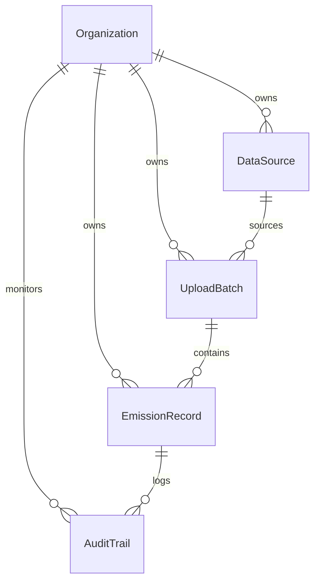

# Data Model & Database Architecture Guide (`MODEL.md`)

This document outlines the schema design, multi-tenancy partitioning, data lineage, validation states, and normalization logic implemented on the ScopeTrace platform database layer.

---

## 1. Schema Design and Entities Relationship

The database is built on Django's ORM and structured into three functional apps: `core` (organization assets), `ingestion` (audit pipelines), and `audit` (append-only ledger trails).

### Core Entities

#### 1. `Organization` (Tenant Separation)
Exposes tenant boundaries. Every master configuration and transactional record belongs strictly to a specific organization.
- **Key Fields**:
  - `id`: UUID (Primary Key)
  - `name`: String (Name of the corporate entity)
  - `created_at` / `updated_at`: Timestamps

#### 2. `DataSource` (Extraction Adapters Configuration)
Exposes the specific configuration, parser types, and ingestion adapters for data feeds.
- **Key Fields**:
  - `id`: UUID (Primary Key)
  - `organization`: ForeignKey to `Organization` (Multi-tenant partition)
  - `name`: String (e.g. "SAP Q1 Carbon Feed", "London HQ Billing")
  - `source_type`: Choice Enum (`SAP_FUEL`, `UTILITY_ELECTRICITY`, `CORP_TRAVEL`)

#### 3. `UploadBatch` (Ingestion Context & Statistics)
Tracks files processed through the parser adapters and aggregates run statistics.
- **Key Fields**:
  - `id`: UUID (Primary Key)
  - `organization`: ForeignKey to `Organization`
  - `data_source`: ForeignKey to `DataSource`
  - `file_name`: String (The exact report name)
  - `status`: Choice Enum (`PROCESSING`, `COMPLETED`, `FAILED`)
  - `total_rows` / `failed_rows`: Numerical metrics tracking pipeline errors

#### 4. `EmissionRecord` (Normalized Carbon Account Ledger)
The transactional ledger storing clean, normalized greenhouse gas emissions for analytics and review.
- **Key Fields**:
  - `id`: UUID (Primary Key)
  - `organization`: ForeignKey to `Organization`
  - `batch`: ForeignKey to `UploadBatch`
  - `row_index`: Integer (Maintains file index for line-item error auditing)
  - `raw_data_payload`: JSONField (Exposes the original file parameters for review)
  - `status`: Choice Enum (`DRAFT`, `SUSPICIOUS`, `APPROVED`, `FAILED`)
  - `is_suspicious`: Boolean flag indicating outlier warnings
  - `validation_errors`: JSONField mapping validation error arrays
  - `normalized_value`: High-precision Decimal holding the normalized value in the base activity unit (L / kWh / km) — the basis for downstream CO₂e calculation
  - `normalized_unit`: String base unit (`L`, `kWh`, `km`)
  - `scope_category`: Choice Enum (`SCOPE_1` for fuel, `SCOPE_2` for power, `SCOPE_3` for travel)
  - `approved_by`: ForeignKey to User model (Attribution tracking)
  - `approved_at`: DateTime (Analyst lock timestamp)

#### 5. `AuditTrail` (Append-Only Transactional Ledger)
Immutable historical record tracking state transitions (such as analyst approvals).
- **Key Fields**:
  - `id`: UUID (Primary Key)
  - `organization`: ForeignKey to `Organization`
  - `record`: ForeignKey to `EmissionRecord`
  - `record_uuid_backup`: UUID (Backup parameter keeping the audit trace intact if a record is dropped)
  - `action`: String (e.g. `RECORD_APPROVAL`)
  - `changed_by`: ForeignKey to User model
  - `changes`: JSONField mapping state diffs (e.g. `{"status": ["DRAFT", "APPROVED"]}`)
  - `reason`: Text (Analyst rationale)

---

## 2. Robust Multi-Tenancy Architecture

We enforce **logical multi-tenancy** partitioning:
1. Every master-data configuration (`DataSource`) and transactional element (`UploadBatch`, `EmissionRecord`, `AuditTrail`) contains a direct ForeignKey referencing `Organization`.
2. View queries and bulk ingestion operations strictly partition database operations using the tenant ID.
3. This logical layout provides high performance, database index efficiency (filtering by `organization_id`), and is perfectly suited for SaaS deployments.

---

## 3. Data Lineage and Row-Level Tracing

Data integrity is fully auditable from raw data file to locked carbon accounts:
- **`raw_data_payload` Preservation**: The parser adapters stream raw records to the database as a JSONField. The analyst can view the exact spreadsheet rows (e.g. original billing periods, cost currencies) in their sidebar review cards.
- **`row_index` Matching**: Line numbers from raw logs are written to the database. If an ingestion batch fails due to corrupt schemas, the analyst sees the exact line index (e.g., "Row #4: negative fuel amount") to quickly edit source files.

---

## 4. Ingestion Validation States (Two-Tier Model)

The validation adapter uses a strict, non-destructive **two-tier** system:

### Tier 1: `FAILED` (Critical Structural Issues)
- **Trigger**: Non-numeric numbers, negative amounts, future dates, corrupt structures, or unknown units.
- **Result**: Ingestion continues, but the specific row receives `status = FAILED`, `normalized_value = null`, and validation errors are saved to `validation_errors`. The batch status remains intact but tracks the failed row count. Analysts cannot approve a `FAILED` record.

### Tier 2: `SUSPICIOUS` (Data Anomaly Warnings)
- **Trigger**: Dates posted > 365 days ago, or quantities exceeding a dynamic **outlier detection limit** (calculated as $> 3 \times \text{median}$ of the ingestion batch).
- **Result**: The row is parsed and normalized successfully (`status = SUSPICIOUS`, `is_suspicious = True`), and a warning is logged to `validation_errors`. The analyst must review and justify the anomaly in the dashboard before lock-securing it.

---

## 5. High-Precision Normalization Logic

All unit conversions are normalized to base activity scales using Python’s high-precision `Decimal` object (CO₂e emission factors are applied in a later phase):

| Feed Type | Source Unit | Normalization Target | Conversion Ratio / Logic | Scope Target |
| :--- | :---: | :---: | :--- | :---: |
| **SAP Fuel** | `L` (Liters) | `L` (Liters) | $1.0\times$ Liters | **Scope 1** |
| | `M3` (Cubic Meters) | `L` (Liters) | $1000.0\times$ Liters | **Scope 1** |
| **Utility Power** | `kWh` | `kWh` | $1.0\times$ kWh | **Scope 2** |
| | `MWh` | `kWh` | $1000.0\times$ kWh | **Scope 2** |
| **Corp Travel** | `km` (Rail/Flight) | `km` | $1.0\times$ km (Haversine if missing) | **Scope 3** |

### Advanced Business Air-Seating Multipliers
Corporate travel uses **DEFRA seating class multipliers** to compute accurate passenger carbon footprints:
- **`ECONOMY`**: $1.0\times$ distance
- **`PREMIUM_ECONOMY`**: $1.6\times$ distance
- **`BUSINESS`**: $2.9\times$ distance
- **`FIRST`**: $4.0\times$ distance
