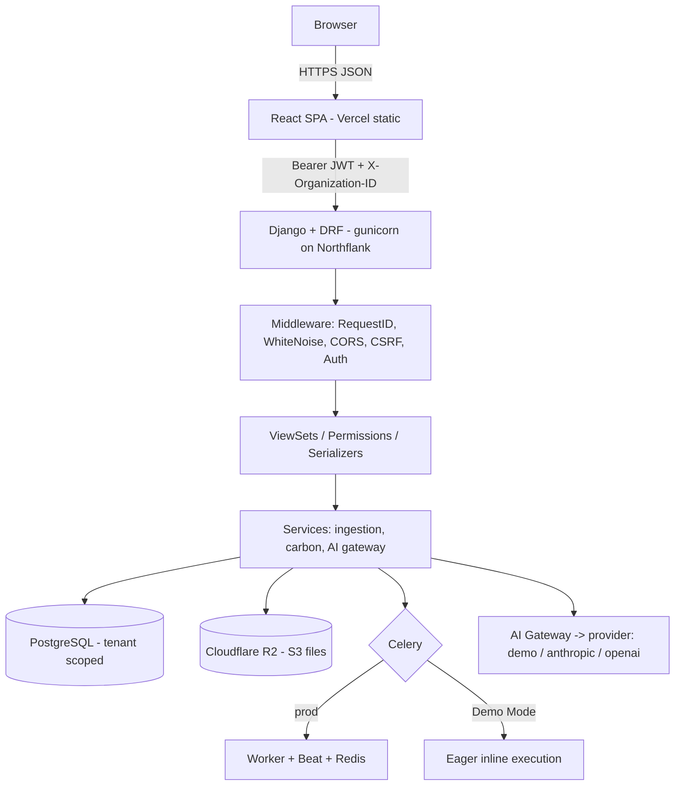
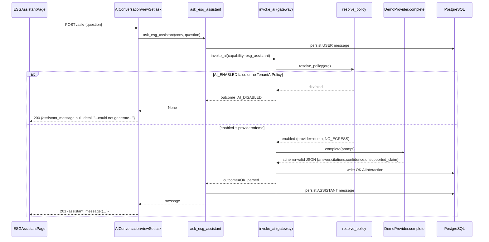
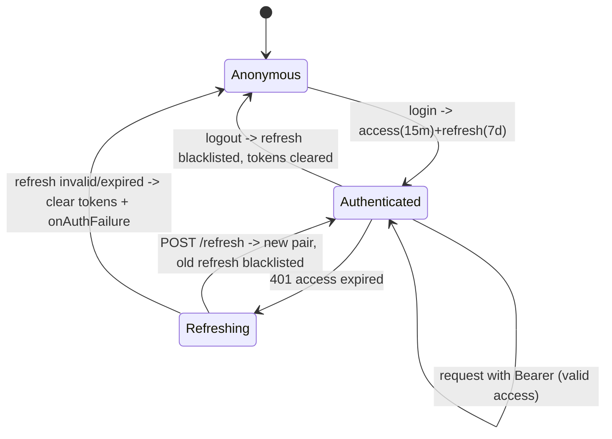
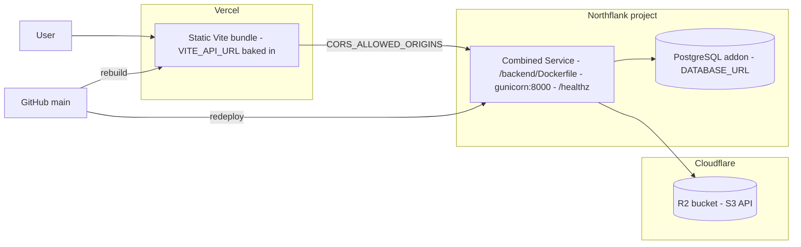
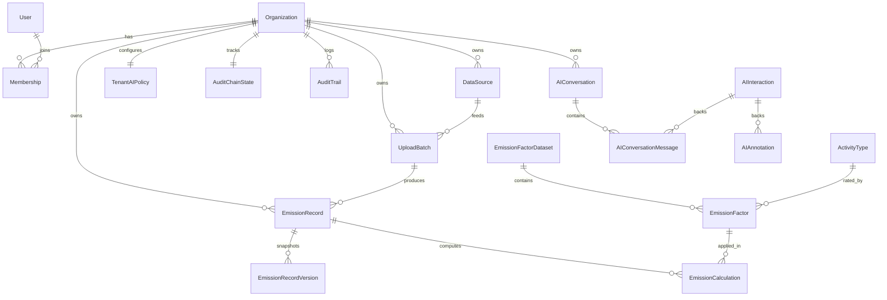
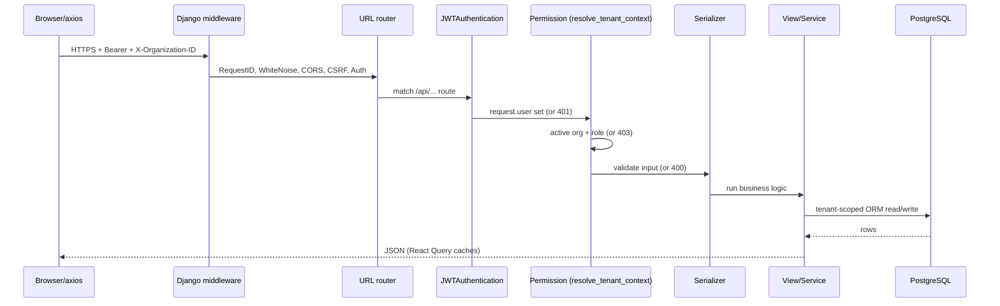

# ScopeTrace — Complete Technical Handover

> A full engineering handover for the ScopeTrace ESG data platform. Written to be read by a senior engineer who has never seen the codebase, and to double as interview-prep material. Every claim below is tied to a real file/class/function. Version 1.0.0.

**Production URLs**
- Frontend (Vercel): `https://scopetrace-platform.vercel.app`
- Backend (Northflank): `https://p01--scopetrace-backend--7gpwm4f4br2c.code.run`
- Repo: `github.com/Utkarshum7/scopetrace-platform`

**Repo top-level layout**
```
backend/     Django 6 + DRF API (Python 3.12)
frontend/    React 18 + Vite 5 SPA (served static via nginx / Vercel)
deployment/  northflank/ (template.json, CHECKLIST.md, README.md)
docs/        architecture, deployment, ADRs, this handover
docker-compose.yml   full local stack (api, worker, beat, db, redis, minio, frontend)
render.yaml          production Render blueprint (api + worker + beat + redis + db)
```

---

## SECTION 1 — PROJECT OVERVIEW

### Purpose
ScopeTrace is a multi-tenant SaaS for **corporate greenhouse-gas (carbon) accounting**. Organizations upload activity data (fuel, electricity, travel), and the platform ingests, validates, normalizes, and converts it into auditable CO₂-equivalent emissions across the three GHG-Protocol scopes, with a review/approval workflow, a tamper-evident audit trail, dashboards, and advisory AI.

### Problem statement / business problem
ESG/carbon reporting is legally and reputationally material but operationally messy: activity data arrives from heterogeneous systems (SAP exports in German, utility portals, travel systems) in inconsistent formats; emission factors change by region/year/publisher; and regulators/auditors demand that every reported number be traceable to its source and to the exact factor used. Spreadsheets can't provide isolation between clients, an immutable audit chain, or role-separated approvals. ScopeTrace productizes that pipeline.

### Target users & stakeholders
- **ESG Analysts** — upload data, review flagged records, submit for approval.
- **Auditors** — verify the audit chain, view activity, approve/reject.
- **Organization Admins** — everything within their org + manage org resources.
- **Platform Admins** (Django superusers) — cross-tenant operations, observability.
- **Viewers** — read-only.
- Stakeholders beyond users: compliance/finance teams who consume the reports; the auditors' external firms who need the hash-chain proof.

### End-to-end workflow
Upload CSV/JSON → ingest & validate rows → resolve emission factor → compute CO₂e per record → analyst reviews/flags → submit → approve (record frozen) → dashboards & compliance reports reflect approved data → audit chain records every state change → optional AI advisory (anomaly explanations, factor recommendations, ESG Q&A).

### High-level architecture
```
┌────────────┐  HTTPS/JSON  ┌──────────────────────────────────────┐
│  Browser   │─────────────▶│  React SPA (Vite build, static)      │
│ (Vercel)   │◀─────────────│  axios + JWT in localStorage         │
└────────────┘              └───────────────┬──────────────────────┘
                                            │ Bearer JWT + X-Organization-ID
                                            ▼
                        ┌───────────────────────────────────────────┐
                        │ Django + DRF (gunicorn, Northflank/Render) │
                        │  WhiteNoise static · CORS · RequestID mw   │
                        │  ViewSets · Permissions · Serializers      │
                        │  Services (ingestion, carbon, AI gateway)  │
                        └───────┬───────────────────┬───────────────┘
                                │                   │
              ┌─────────────────▼──┐      ┌─────────▼──────────────┐
              │ PostgreSQL         │      │ Celery (prod) / eager  │
              │ (tenant-scoped)    │      │ (Demo Mode: inline)    │
              └────────────────────┘      └─────────┬──────────────┘
                                                    │
                          Redis broker (prod) ──────┘   Cloudflare R2 (S3) for files
```

### End-to-end request flow (browser → DB), generic
1. React calls `apiService.*` (`frontend/src/services/api.js`); axios attaches `Authorization: Bearer <access>` (request interceptor, `api.js:43`) and the caller adds `X-Organization-ID`.
2. Request hits gunicorn → Django middleware chain (`RequestIDMiddleware`, WhiteNoise, CORS, CSRF, Auth) → `config/urls.py` routes `api/...` into an app `urls.py`.
3. DRF authenticates the JWT (`JWTAuthentication`, `settings.py:290`), runs the view's `permission_classes` (which call `resolve_tenant_context`), the serializer validates input, the view calls a service, the service reads/writes tenant-scoped ORM rows in PostgreSQL.
4. Response is serialized to JSON and returned; React Query caches it; the component renders.

---

## SECTION 2 — COMPLETE FEATURE LIST

For each: purpose · flow · APIs · tables · rules · security · validation · errors.

1. **JWT authentication** — log in/refresh/logout/whoami. Flow: `POST /api/auth/login/` → tokens. APIs: `/api/auth/login|refresh|logout/`, `/api/me/`. Tables: `auth_user`, `token_blacklist_*`, `Membership`. Rules: username+password; access 15 min, refresh 7 days rotating+blacklisted. Security: `AllowAny` on login/refresh, `IsAuthenticated` on logout/me; failed logins logged (username+IP, never password). Validation: SimpleJWT. Errors: 401 non-enumerating message.

2. **Multi-tenant org context** — every non-superuser acts within one active org. Resolved by `apps/accounts/tenancy.py:resolve_tenant_context` from active `Membership` + optional `X-Organization-ID`. Errors: 403 if header names an org you're not a member of.

3. **File upload (3 source types)** — SAP fuel, utility electricity, corporate travel. `POST /api/upload/{sap|utility|travel}/` (multipart: `file`, `data_source`). Tables: `UploadBatch`, `EmissionRecord`. Rules: file ≤10 MB, extension ∈ {.csv,.json}, `DataSource` must belong to caller's org and match the route's `source_type`. Security: `CanUpload` (ORG_ADMIN/ANALYST). Returns 202 + `batch_id`. Errors: 400 (bad file/type), 403 (wrong org/role), 503 (storage down).

4. **Asynchronous/synchronous ingestion pipeline** — `ingest → calculate` Celery chain (prod) or inline (Demo Mode). Parses, validates, normalizes, flags suspicious rows, computes CO₂e.

5. **Carbon calculation engine** — resolves an `EmissionFactor` per record deterministically and computes `co2e`. Tables: `EmissionCalculation`, `EmissionFactor`, `EmissionFactorDataset`, `ActivityType`, `ActivityMapping`, `UnitConversion`, `Region`, `GwpSet`. Read APIs: `/api/calculations/`, `/api/emission-factors/`, `/api/factor-datasets/`, `/api/activity-types/`.

6. **Governance workflow** — DRAFT/SUSPICIOUS/VALIDATED → SUBMITTED → APPROVED (terminal, frozen) or REJECTED → resubmit. Actions on `EmissionRecordViewSet`: `submit` (CanUpload), `approve`/`reject` (CanApprove), `workflow` (read). Approved records are immutable.

7. **Soft delete + restore** — `DELETE /api/records/{id}/` (reason required) sets `is_deleted`; `restore` un-deletes. `IsOrgAdmin`. Hard delete is forbidden at the model layer.

8. **Record versioning** — every calculation-affecting change snapshots an `EmissionRecordVersion`. Read: `versions`, `versions/{n}`, `versions/{n}/compare`.

9. **Recalculate** — `recalculate` re-runs the engine with current factors on non-approved records (`CanManageOrgResources`).

10. **Tamper-evident audit trail** — every state change appends an `AuditTrail` row into a per-org hash chain (`prev_hash`→`entry_hash`, monotonic `sequence`). Verify: `GET /api/audit/verify/` (`CanViewActivity`).

11. **Dashboards & metrics** — summary, timeseries, breakdown, activity feed, platform. `/api/metrics/*`.

12. **Compliance reports** — JSON + streaming CSV. `/api/reports/compliance/` and `/csv/` (`CanViewActivity`).

13. **CSV export of records** — `GET /api/records/export/` (streamed, `IsOrgMember`).

14. **AI advisory (Phase 7)** — anomaly explanations, factor recommendations, validation assistance, ESG Assistant chat, report narration. All routed through the single AI gateway. Advisory only — never mutates governed data.

15. **AI observability & cost governance (admin)** — `/api/ai/costs/`, `/api/ai/ops/observability/`, `/api/ai/ops/health/`.

16. **Health probes** — `/healthz` (DB), `/healthz/worker/` (Celery / Demo Mode), `/healthz/ai/` (provider config).

17. **Demo Mode** — single-service, no worker/broker; synchronous pipeline; `demo` AI provider. Toggled by `DEMO_MODE=True`.

18. **Django admin** — populated ModelAdmins for all core models (hidden/admin feature).

---

## SECTION 3 — APPLICATION PAGES

Pages live in `frontend/src/pages/`. Global state: `AuthContext` (`context/AuthContext.jsx`) + **React Query** (`@tanstack/react-query`). All data fetching goes through `apiService` (`services/api.js`).

- **LoginPage** (`LoginPage.jsx`) — purpose: authenticate. Data: username/password form + demo-credential hint. Endpoint: `/api/auth/login/`. State: local form state; on success `AuthContext.login` stores tokens + user. Permissions: public.

- **DashboardPage** (`DashboardPage.jsx`) — role-aware widget grid. Widgets from `components/dashboard/` (`registry.js`, `WidgetFrame`, `useWidgetData.js`, role widget sets: `AnalystWidgets`, `AuditorWidgets`, `OrgAdminWidgets`, `PlatformWidgets`, `CommonWidgets`, `AIObservabilityWidgets`). Data: KPI cards, charts (`components/charts/` — `BarChart`, `DonutChart`, `TrendChart` via **Recharts**). Endpoints: `/api/metrics/summary|timeseries|breakdown|activity|platform/`. Filters: `DashboardFilters.jsx` (time/scope). State: React Query queries keyed by filters. Permissions: widgets gated by role/`is_platform_admin`.

- **UploadPage / Upload Center** (`UploadPage.jsx`) — purpose: upload a file to a DataSource. Data: source-type selector (`SelectableCard`), DataSource dropdown, drag/drop, progress bar. Endpoint: `POST /api/upload/{sourceType}/` via `apiService.uploadFile` (multipart). Hook: `useBatchProgress.js` polls `/api/batches/{id}/progress/`. Mutations: upload. Permissions: only ANALYST/ORG_ADMIN see it usefully (`CanUpload`).

- **RecordsPage / Review Ledger** (`RecordsPage.jsx`) — purpose: browse/review emission records, run workflow actions. Data: paginated table with `StatusBadge`, filters (`FilterBar.jsx` — data_source, batch, suspicious, failed, status, show-deleted), detail drawer, AI advisory panel (`AIInsightsPanel.jsx`), approval modal (`ApprovalModal.jsx`). Endpoints: `/api/records/` (list, paginated), `/api/records/{id}/` (detail), `submit|approve|reject|restore|recalculate`, `ai-annotations`, `factor-recommendations`. Mutations invalidate React Query caches. Pagination: DRF `count/next/previous/results` (page size 50). Permissions: read=IsOrgMember; approve=CanApprove; deleted view=IsOrgAdmin.

- **ESGAssistantPage** (`ESGAssistantPage.jsx`) — conversational advisory chat (see Section 11). Endpoints: `/api/esg-assistant/conversations/` (+`/{id}/messages/`, `/{id}/ask/`). State: local `messages`, optimistic user message, `isAsking` spinner. Permissions: `CanUseAI`.

- **Admin** — Django admin at `/admin/` (server-rendered, superuser). No React admin page.

---

## SECTION 4 — AUTHENTICATION

**Stack**: `rest_framework_simplejwt`. Config in `settings.py:362-371` (`SIMPLE_JWT`): access 15 min (`JWT_ACCESS_MINUTES`), refresh 7 days (`JWT_REFRESH_DAYS`), `ROTATE_REFRESH_TOKENS=True`, `BLACKLIST_AFTER_ROTATION=True`, `AUTH_HEADER_TYPES=('Bearer',)`, `SIGNING_KEY=JWT_SIGNING_KEY` (falls back to `SECRET_KEY`).

**Views** (`apps/accounts/views.py`): `LoginView` (`TokenObtainPairView`, AllowAny, logs failed attempts), `RefreshView` (AllowAny, rotates+blacklists), `LogoutView` (IsAuthenticated, blacklists a supplied refresh token → 205), `MeView` (IsAuthenticated, returns user + memberships + active org/role + `demo_mode`). Serializer `LoginSerializer` (`serializers.py:40`) augments the token pair with the user profile.

**Frontend** (`services/api.js`): access+refresh in `localStorage` (`tokenStore`). Request interceptor attaches Bearer. Response interceptor: on 401 (non-auth call, not already retried, refresh present) → single shared refresh call → retry original; on refresh failure → clear tokens + `onAuthFailure()` (registered by `AuthContext` to force logout).

**Role checking**: JWT identifies the user; role comes from the active `Membership` resolved server-side per request (`resolve_tenant_context`). Superusers are platform admins and bypass memberships.

**Protected routes**: `App.jsx` gates the app on `AuthContext.user`; unauthenticated → LoginPage.

**Permission decorators/classes**: DRF `permission_classes` on each view (`apps/accounts/permissions.py`), not function decorators. `DEFAULT_PERMISSION_CLASSES=[IsAuthenticated]` so everything is closed by default.

**Middleware**: `RequestIDMiddleware` (correlation id), WhiteNoise, CORS, Session, Common, CSRF, Auth, Messages, XFrame (`settings.py:118-134`). JWT auth is a DRF layer, not Django middleware.

**Sequence (login)**
```
Browser → POST /api/auth/login/ {username,password}
  → LoginView.post → LoginSerializer.validate → authenticate() → issue access+refresh
  ← 200 {access, refresh, user}
Browser stores tokens; subsequent calls send Bearer + X-Organization-ID
  → JWTAuthentication verifies exp/signature → request.user set
  → permission class → resolve_tenant_context → view runs
```

---

## SECTION 5 — USER ROLES

Defined in `apps/accounts/models.py` (`Role` TextChoices + capability frozensets). Permission classes in `apps/accounts/permissions.py` (all extend `IsOrgMember`).

- **Platform Admin** (Django superuser) — cross-tenant. Class `IsPlatformAdmin`. Can access `/api/metrics/platform/`, AI ops observability/health. Bypasses membership checks; `X-Organization-ID` optionally scopes them to one org. Not a membership `Role`.

- **Organization Admin** (`ORG_ADMIN`) — full org control: upload, approve, manage org resources, soft-delete/restore, recalculate, use AI, view activity/AI costs. In `ROLES_CAN_UPLOAD/APPROVE/MANAGE_ORG/VIEW_ACTIVITY/USE_AI`. Classes: `IsOrgAdmin`, `CanManageOrgResources`, `CanManageAIPolicy`.

- **Analyst** (`ANALYST`) — upload + submit + approve + use AI; cannot manage org resources or view the audit/activity feed. In UPLOAD/APPROVE/USE_AI.

- **Auditor** (`AUDITOR`) — approve + view activity + verify audit chain + view AI costs + use AI; cannot upload. In APPROVE/VIEW_ACTIVITY/USE_AI. Classes: `CanApprove`, `CanViewActivity`, `CanViewAICosts`.

- **Viewer** (`VIEWER`) — read-only lists/details/metrics only; in no capability set.

**Object-level isolation**: `IsOrgMember.has_object_permission` checks `obj.organization_id == active org` (defense in depth alongside queryset scoping via `TenantScopedViewSetMixin`).

**Frontend hidden features**: role flags on `AuthContext` (e.g. `canViewDeletedRecords`) hide the deleted-records toggle, upload center, approve buttons, and platform/AI-ops widgets for roles that lack them.

---

## SECTION 6 — DATABASE DESIGN

All PKs are `UUIDField`. One `default` alias, built from `DATABASE_URL`. Tenant models carry `organization` FK and are query-scoped.

### apps.core
- **Organization** — `id, name(unique), created_at, updated_at`. The tenant. Used by nearly every API.
- **DataSource** — `id, organization(FK), name, source_type(SAP_FUEL|UTILITY_ELECTRICITY|CORP_TRAVEL), expected_schema(JSON), timestamps`. `unique_together(organization,name)`. Used by upload + `/api/datasources/`.

### apps.accounts
- **Membership** — `id, user(FK), organization(FK), role(ORG_ADMIN|ANALYST|AUDITOR|VIEWER), active, timestamps`. `UniqueConstraint(user,organization)`. Drives all RBAC/tenant resolution.
- (User = stock `django.contrib.auth.models.User`; no custom model.)

### apps.ingestion
- **UploadBatch** — `id, organization, data_source, file_name, status(PENDING/QUEUED/…), total_rows, failed_rows, uploaded_by, error_message, parse_errors(JSON), started_at, finished_at, worker_id, retry_count, celery_task_id, calculation_status, workflow_id, pipeline_version, timestamps`. Indexes on `(status,updated_at)`, `(calculation_status,updated_at)`. Used by upload + `/api/batches/`.
- **EmissionRecord** — `id, organization, batch(FK), row_index, raw_data_payload(JSON), status, is_suspicious, validation_errors(JSON), normalized_value(Decimal), normalized_unit, scope_category, approved_by, approved_at, is_deleted, deleted_at, timestamps`. `unique_together(batch,row_index)`. Indexes `(organization,is_deleted)`, `(organization,status)`. Managers: `objects` (active) / `all_objects` (incl. deleted). Central business row.
- **EmissionRecordVersion** — immutable snapshot per change: `record, record_uuid_backup, organization, version_number, status, is_suspicious, scope_category, normalized_*, approved_*, validation_errors, raw_data_payload, is_deleted, deleted_at, calculation(FK), created_by, reason, created_at`. `UniqueConstraint(record,version_number)`.

### apps.carbon
- **Region** — `code(unique), name, parent(self FK)`.
- **GwpSet** — global-warming-potential coefficients (`gwp_co2/ch4/n2o`).
- **ActivityType** — `code(unique), name, default_scope, base_unit, gas_basis`. Index on `default_scope`.
- **EmissionFactorDataset** — `publisher, name, version, region, status(DRAFT/ACTIVE/…), valid_from, valid_to, priority, checksum, source_*, imported_by, metadata`. Immutable once ACTIVE (enforced via QuerySet). Indexes on `(publisher,status)`, `(status,valid_from)`.
- **EmissionFactor** — `dataset, activity_type, region, unit, co2e_per_unit(Decimal 30,12), co2/ch4/n2o_per_unit, gwp_set, valid_from/to, methodology, uncertainty_pct`. Unique per (dataset,activity_type,region,unit,…). Indexes for effective-date resolution.
- **UnitConversion** — `from_unit, to_unit, dimension, factor`. `unique(from_unit,to_unit)`.
- **ActivityMapping** — maps `(data_source_type, match_key)` → `ActivityType`(+region), with `priority`. Index `(data_source_type,match_key)`.
- **OrgFactorPolicy** — per-org `preferred_publisher, default_region, strict_mode`.
- **EmissionCalculation** — `organization, emission_record(PROTECT FK), is_current, activity_type, emission_factor, …co2e…`. The computed result per record; `/api/calculations/`.

### apps.audit
- **AuditTrail** — `id, organization, record(FK, SET_NULL), record_uuid_backup, action, changed_by, changes(JSON), reason, timestamp, sequence(bigint), prev_hash, entry_hash`. `UniqueConstraint(organization,sequence)`. The hash-chained ledger.
- **AuditChainState** — per-org `last_sequence, last_hash` (genesis default). Serializes appends.

### apps.ai
- **AIPromptVersion** — versioned prompt templates (`name, version, template_hash, template_text, response_schema_id/version`). Unique on `(name,version)` and `(name,template_hash)`.
- **TenantAIPolicy** — **per-org AI opt-in** (OneToOne org PK): `ai_enabled(default False), provider_override, model_override, monthly_budget_usd, egress_tier(REDACTED|RAW|NO_EGRESS), byo_api_key_ref`. Absence = disabled.
- **AIInteraction** — the immutable audit row for every gateway call: `organization, actor, capability, provider, model_id, prompt_version/hashes, context_provenance, parameters(JSON), response_hash, response_text (idempotent only), schema_valid, outcome(OK/AI_DISABLED/BUDGET_EXCEEDED/EGRESS_BLOCKED/SCHEMA_INVALID/ERROR), tokens, cost_usd, latency_ms, egress_tier_applied, redaction_applied, idempotency_key, gateway_version`. Partial `UniqueConstraint(organization,idempotency_key) WHERE outcome=OK`.
- **AIAnnotation** — advisory explanation per record (anomaly/validation): `record, interaction, capability, explanation, contributing_factors, confidence, suggested_investigation`.
- **AIFactorRecommendation** — advisory factor pick per record.
- **AIConversation** — ESG-assistant thread: `organization, user(SET_NULL), created_at`. Org-scoped, not per-user-private.
- **AIConversationMessage** — immutable message: `conversation, interaction, role(USER/ASSISTANT), content, citations(JSON), confidence, unsupported_claim, retrieved_context`.

---

## SECTION 7 — BACKEND (folder by folder)

`backend/config/` — project: `settings.py` (all config, fail-closed), `urls.py` (root routes), `wsgi.py`, `celery.py` (Celery app, reads `CELERY_*` from settings, autodiscovers tasks).

`backend/apps/core/` — cross-cutting: `models.py` (Organization, DataSource), `middleware.py` (`RequestIDMiddleware`), `views.py` (health probes), `storage/` (StorageService abstraction: `factory.get_storage_service`, providers `local`/`s3`), `execution.py` (`resolve_celery_execution` — derives eager mode from DEMO_MODE), `pagination.py`, `exception_handlers.py`, `logging_utils.py`, `management/commands/bootstrap_data.py`, `tasks.py` (heartbeat, notifications).

`backend/apps/accounts/` — identity/RBAC: `models.py` (Role, Membership), `tenancy.py` (`resolve_tenant_context`, `TenantContext`), `permissions.py` (all permission classes), `mixins.py` (`TenantScopedViewSetMixin`), `views.py` (auth), `serializers.py`, `urls.py`.

`backend/apps/ingestion/` — intake + workflow: `views.py` (`BaseUploadView` + SAP/Utility/Travel subclasses; `UploadBatchViewSet`; `EmissionRecordViewSet` with all workflow actions; Organization/DataSource viewsets), `serializers.py` (`UploadInputSerializer` etc.), `services/` (`ingestion_service`, `validator`, `sap_parser`, `utility_parser`, `workflow`, `soft_delete`, `versioning`), `tasks.py` (`ingest_task`), `export_views.py`, `models.py`.

`backend/apps/carbon/` — factors + calculation + metrics: `services/` (`carbon_service`, `resolution` FactorIndex, `inputs`, `metrics_cache`), `views.py` (reference viewsets), `metrics_views.py`, `report_views.py`, `tasks.py` (`calculate_task`, backfill/recalc), `management/commands/` (`seed_carbon`, `backfill_calculations`, `import_emission_factors`), `models.py`.

`backend/apps/audit/` — `services.py` (`append_entry` — hash-chain writer), `views.py` (`AuditChainVerifyView`), `management/commands/verify_audit_chain.py`, `models.py`.

`backend/apps/ai/` — the AI subsystem (Section 11): `services/` (`gateway`, `policy`, `egress`, `cost`, `esg_assistant`, `esg_context_builder`, `anomaly_detection`, `factor_recommendation`, `validation_assistance`, `report_narration`, `observability`, `ops_health`, `cache_metrics`), `providers/` (`base`, `factory`, `echo`, `demo`, `anthropic`, `openai`, `replay`), `prompts/` (`registry` + `templates/*.txt`), `schemas.py`, `views.py`, `ops_views.py`, `tasks.py`, `models.py`, `evaluation/` (LLM-as-judge harness, off by default).

`backend/apps/tasks/` — dead-letter/failed-task logging (`signals.py`, `replay_failed_task`).

---

## SECTION 8 — COMPLETE API REFERENCE

Conventions: all `/api/*` routes require a JWT `Authorization: Bearer <access>` header unless marked **AllowAny**. Non-superusers must send `X-Organization-ID: <uuid>` (or the first active membership is used). Paginated list endpoints return `{count, next, previous, results}` (page size 50, `?page=` / `?page_size=`). Errors use `{"detail": "..."}`. Common error codes: **401** (missing/expired token), **403** (role/tenant denied), **404** (not found/out of tenant), **400** (validation).

### 8.1 Health (public, non-DRF — `apps/core/views.py`)

**`GET /healthz`** · Auth: none · Perm: none · Request: — · Response 200 `{"status":"ok","database":"ok"}` / 503 `{"status":"unhealthy","database":"unreachable","detail":...}` · Logic: `SELECT 1`. · DB: connection only. · Caller: orchestrator/uptime, not React.

**`GET /healthz/worker/`** · Auth: none · Response: Demo Mode → 200 `{"status":"ok","mode":"demo","demo_mode":true}`; prod → 200 with worker list or 503 if broker/worker down. · Logic: `inspect().ping()` unless `DEMO_MODE`.

**`GET /healthz/ai/`** · Auth: none · Response 200 `{"status":"ok","ai_enabled":<settings.AI_ENABLED>,"provider":...,"model":...}` or 503 if provider misconfigured. · Logic: constructs the provider (no network). Use this to confirm the global `AI_ENABLED`.

### 8.2 Authentication (`apps/accounts/views.py`, `apps/accounts/urls.py`)

**`POST /api/auth/login/`** · **AllowAny** · Perm: none · Throttle: `login` (10/min) · Request `{"username":str,"password":str}` · Response 200 `{"access":jwt,"refresh":jwt,"user":{id,username,email,first_name,last_name,is_platform_admin,memberships:[{id,organization_id,organization_name,role,active}]}}` · Errors 401 `{"detail":"No active account found with the given credentials"}` (non-enumerating) · Logic: `LoginView`(`TokenObtainPairView`)→`LoginSerializer.validate`→`authenticate()`; failed attempts logged (username+IP). · DB: `auth_user`, `Membership`. · Caller: `apiService.login` ← `LoginPage`.
```
curl -X POST $BASE/api/auth/login/ -H 'Content-Type: application/json' \
     -d '{"username":"orgadmin","password":"demo12345"}'
```

**`POST /api/auth/refresh/`** · **AllowAny** · Request `{"refresh":jwt}` · Response 200 `{"access":jwt,"refresh":jwt}` (old refresh blacklisted, new pair issued) · Errors 401 invalid/expired · Logic: `RefreshView`(`TokenRefreshView`), `ROTATE_REFRESH_TOKENS`+`BLACKLIST_AFTER_ROTATION`. · DB: `token_blacklist_*`. · Caller: axios 401 interceptor.

**`POST /api/auth/logout/`** · Perm: `IsAuthenticated` · Request `{"refresh":jwt}` · Response 205 (no body) · Errors 400 (missing/invalid refresh) · Logic: `RefreshToken(refresh).blacklist()`. · DB: `token_blacklist_*`. · Caller: `apiService.logout` ← `AuthContext`.

**`GET /api/me/`** · Perm: `IsAuthenticated` · Response 200 `{id,username,email,…,is_platform_admin,memberships:[…],demo_mode:bool,active_organization:{id,name}|null,active_role:str|null}` · Logic: `MeView`; `resolve_tenant_context`. · DB: `auth_user`,`Membership`,`Organization`. · Caller: `apiService.getCurrentUser` ← `AuthContext` on hydrate.

### 8.3 Ingestion (`apps/ingestion/views.py`, `apps/ingestion/urls.py`)

**`POST /api/upload/{sap|utility|travel}/`** · Perm: `CanUpload` (ORG_ADMIN/ANALYST) · Content-Type: `multipart/form-data` · Request fields: `file` (File, req, .csv/.json, ≤10 MB), `data_source` (UUID PK, req) · Response **202** `{batch_id,file_name,status,total_rows,failed_rows,errors,error_message,successful_records,processed_records,progress_percentage,duration_seconds,…}` · Errors 400 (empty/oversized/bad ext, or DataSource type ≠ route type), 403 (DataSource not in your org / role), 503 (storage unavailable) · Logic: `UploadInputSerializer.is_valid` → tenant+type check → create `UploadBatch(PENDING)` → `storage.save` to R2 (server-derived content-type) → `chain(ingest_task,calculate_task).delay()` (inline under Demo Mode). · DB: `DataSource`,`UploadBatch`,(async)`EmissionRecord`,`EmissionCalculation`. · Caller: `apiService.uploadFile` ← `UploadPage`.

**`GET /api/records/export/`** · Perm: `IsOrgMember` · Query: same record filters as list · Response 200 streamed `text/csv` (`RecordExportView`, `export_views.py`) · Caller: `apiService.exportRecords` (blob download).

**`GET /api/batches/`** · Perm: `IsOrgMember` · `UploadBatchViewSet` (ReadOnly) · Response 200 paginated `UploadBatchSerializer` (`id,file_name,status,calculation_status,total_rows,failed_rows,data_source_details,successful_records,processed_records,progress_percentage,duration_seconds,…`) · Caller: `apiService.getBatches`.
**`GET /api/batches/{id}/`** · retrieve one batch (404 if not in org).
**`GET /api/batches/{id}/progress/`** · lean `BatchProgressSerializer` for polling · Caller: `apiService.getBatchProgress` ← `useBatchProgress`.

**`GET /api/records/`** · Perm: `IsOrgMember` (→ `IsOrgAdmin` if `?deleted=true`) · `EmissionRecordViewSet` · Query params: `data_source`(uuid), `batch`(uuid), `suspicious`(true/1), `failed`(true/1), `status`(RecordStatus), `deleted`(true/1), `page`, `page_size` · Response 200 paginated `EmissionRecordSerializer` (`id,batch,row_index,status,is_suspicious,normalized_value,normalized_unit,scope_category,co2e_kg,co2e_tonnes,calculation_status,factor_provenance,calculation_trace,validation_errors,raw_data_payload,is_deleted,…`) · Caller: `apiService.getRecords` ← `RecordsPage`.
**`GET /api/records/{id}/`** · retrieve one.
**`DELETE /api/records/{id}/`** · Perm: `IsOrgAdmin` · Request `{"reason":str(req)}` (`DeletionSerializer`) · Response 200 (serialized record) · Logic: soft-delete via `services/soft_delete.py`, audit entry; 400 if already deleted, 404 if missing.

**`POST /api/records/{id}/submit/`** · Perm: `CanUpload` · Request `{"reason":str(opt)}` (`WorkflowActionSerializer`) · Response 200 record · Logic: `transition_record` DRAFT/SUSPICIOUS/VALIDATED→SUBMITTED; 400 on illegal transition. · DB: `EmissionRecord`,`AuditTrail`,`EmissionRecordVersion`.
**`POST /api/records/{id}/approve/`** · Perm: `CanApprove` · Request optional reason · Response 200 · Logic: SUBMITTED→APPROVED, sets `approved_by/at`, freezes record, `select_for_update`, audit entry.
**`POST /api/records/{id}/reject/`** · Perm: `CanApprove` · Request `{"reason":str(req)}` (`RejectionSerializer`) · Response 200 · Logic: SUBMITTED→REJECTED.
**`POST /api/records/{id}/restore/`** · Perm: `IsOrgAdmin` · Response 200 · Logic: un-delete; 400 if not deleted, 404 if missing.
**`POST /api/records/{id}/recalculate/`** · Perm: `CanManageOrgResources` · Response 200 `EmissionCalculationSerializer` · Logic: re-run engine with current factors on non-approved record; 400 if approved/failed.
**`GET /api/records/{id}/workflow/`** · Perm: `IsOrgMember` · Response 200 `{status, available_actions:[…]}` (`services/workflow.available_actions`).
**`GET /api/records/{id}/versions/`** · list `EmissionRecordVersionSerializer`, newest first.
**`GET /api/records/{id}/versions/{n}/`** · one snapshot.
**`GET /api/records/{id}/versions/{n}/compare/`** · field-by-field diff vs current.
**`GET /api/records/{id}/ai-annotations/`** · `AIAnnotationSerializer[]` (may be `[]`) · Caller: `apiService.getRecordAIAnnotations` ← `AIInsightsPanel`.
**`GET /api/records/{id}/factor-recommendations/`** · `AIFactorRecommendationSerializer[]`.

**`GET /api/organizations/`** · Perm: `IsOrgMember` · `OrganizationSerializer` (`id,name`); orgs you belong to (all for platform admin). · Caller: `apiService.getOrganizations`.
**`GET /api/datasources/`** · Perm: `IsOrgMember` · `DataSourceSerializer` (`id,name,source_type`), org-scoped. · Caller: `apiService.getDataSources` ← `UploadPage`.

### 8.4 Carbon / metrics / reports (`apps/carbon/*`)

**`GET /api/metrics/summary/`** · Perm: `IsOrgMember` · Query: `date_from`,`date_to`,`scope` (optional) · Response 200 `{total_co2e_tonnes, by_scope:{…}, coverage, batch/record counts…}` (cached via calc-version key) · Caller: `apiService.getMetricsSummary` ← Dashboard.
**`GET /api/metrics/timeseries/`** · Query: `bucket`(default `month`), `group_by`, date range · Response: time-bucketed CO₂e series · Caller: `getMetricsTimeseries` ← `TrendChart`.
**`GET /api/metrics/breakdown/`** · Query: `dimension`(default `scope`) · Response: grouped totals · Caller: `getMetricsBreakdown` ← `DonutChart`/`BarChart`.
**`GET /api/metrics/activity/`** · Perm: `CanViewActivity` · Response: last ~50 `AuditTrail` items · Caller: `getActivityFeed`.
**`GET /api/metrics/platform/`** · Perm: `IsPlatformAdmin` · Response: cross-tenant totals/per-org overview · Caller: `getPlatformMetrics` (PlatformWidgets).
**`GET /api/reports/compliance/`** · Perm: `CanViewActivity` · Query: period/scope · Response: JSON compliance report (capped line items).
**`GET /api/reports/compliance/csv/`** · Perm: `CanViewActivity` · Response: streamed uncapped CSV.
**`GET /api/activity-types/`, `/api/factor-datasets/`, `/api/emission-factors/`, `/api/calculations/`** · Perm: `IsOrgMember` · ReadOnly reference/calculation lists (filterable, cached for reference data). `calculations` is org-scoped and excludes soft-deleted records.

### 8.5 Audit (`apps/audit/*`)

**`GET /api/audit/verify/`** · Perm: `CanViewActivity` · Query: optional `organization` (platform admin) · Response 200 `{valid:bool, checked:int, broken_at:seq|null,…}` · Logic: recompute the per-org hash chain and compare to stored `entry_hash`/`AuditChainState`. · DB: `AuditTrail`,`AuditChainState`.

### 8.6 AI (`apps/ai/views.py`, `apps/ai/ops_views.py`)

**`GET /api/esg-assistant/conversations/`** · Perm: `CanUseAI` · Response paginated `AIConversationSerializer` (`id,created_at`), org-scoped · Caller: `listEsgConversations`.
**`POST /api/esg-assistant/conversations/`** · Perm: `CanUseAI` · Request `{}` · Response **201** `{id,created_at}` · Logic: `perform_create` sets org+user · Caller: `createEsgConversation`.
**`GET /api/esg-assistant/conversations/{id}/`** · retrieve.
**`GET /api/esg-assistant/conversations/{id}/messages/`** · Response `AIConversationMessageSerializer[]` (`role,content,citations,confidence,unsupported_claim,retrieved_context,created_at`) oldest-first · Caller: `getEsgConversationMessages`.
**`POST /api/esg-assistant/conversations/{id}/ask/`** · Perm: `CanUseAI` · Throttle: `ai` (60/h) · Request `{"question":str(1–2000)}` (`AskQuestionSerializer`) · Response **201** `{"assistant_message":{…}}` on success, **200** `{"assistant_message":null,"detail":"The assistant could not generate a response right now."}` when AI is unavailable (invariant I6) · Logic: see Section 11. · DB: `AIConversation/Message`,`AIInteraction`,`TenantAIPolicy`. · Caller: `askEsgAssistant` ← `ESGAssistantPage`.
```
curl -X POST $BASE/api/esg-assistant/conversations/$CID/ask/ \
     -H "Authorization: Bearer $ACCESS" -H "X-Organization-ID: $ORG" \
     -H 'Content-Type: application/json' -d '{"question":"What is Scope 1?"}'
```

**`GET /api/report-narration/`** · Perm: `CanViewActivity` · Query: `date_from`,`date_to`,`scope` · Response `AIReportNarrationSerializer[]`.
**`POST /api/report-narration/regenerate/`** · Perm: `CanViewActivity` · Throttle `ai` · Request `{"date_from":date,"date_to":date,"scope":str?}` (`RegenerateNarrationSerializer`) · Response **202** `{"detail":"Report narration generation queued."}` · Logic: dispatches `generate_report_narration_task`.
**`GET /api/ai/costs/`** · Perm: `CanViewAICosts` · Response: org token/spend/budget summary.
**`GET /api/ai/ops/observability/`**, **`GET /api/ai/ops/health/`** · Perm: `IsPlatformAdmin` · platform-wide AI metrics / provider+queue+eval health.

---

## SECTION 8A — ARCHITECTURE DIAGRAMS (Mermaid)

### System architecture


### Login flow
```mermaid
sequenceDiagram
  participant B as Browser (LoginPage)
  participant A as axios (apiService.login)
  participant V as LoginView / LoginSerializer
  participant DB as PostgreSQL
  B->>A: submit username, password
  A->>V: POST /api/auth/login/
  V->>DB: authenticate() lookup auth_user + Membership
  DB-->>V: user + active memberships
  V-->>A: 200 {access, refresh, user}
  A->>B: tokenStore.set(); AuthContext.setUser
  B->>B: render app shell (Dashboard)
```

### Upload flow
```mermaid
sequenceDiagram
  participant B as UploadPage
  participant A as apiService.uploadFile
  participant V as BaseUploadView.post
  participant SR as UploadInputSerializer
  participant ST as StorageService (R2)
  participant C as Celery chain
  participant DB as PostgreSQL
  B->>A: multipart {file, data_source}
  A->>V: POST /api/upload/sap/
  V->>SR: validate (size, ext, org, type)
  V->>DB: create UploadBatch(PENDING)
  V->>ST: save(file) to R2
  V->>C: chain(ingest_task, calculate_task).delay()
  Note over C: prod=async worker; Demo Mode=inline eager
  C->>DB: EmissionRecord rows + EmissionCalculation
  V-->>A: 202 {batch_id, status}
  A->>B: poll /batches/{id}/progress/ until COMPLETED
```

### ESG Assistant flow


### JWT lifecycle


### Deployment architecture


### Database ER (core relationships)


### Request lifecycle (generic)


---

## SECTION 9 — FRONTEND

**Stack**: React 18, Vite 5, Tailwind, React Query, axios, Recharts. Entry `main.jsx` → `App.jsx`.

**Folders** (`frontend/src/`): `pages/` (Dashboard, Upload, Records, ESGAssistant, Login), `components/` (`charts/`, `dashboard/` incl. `widgets/`, `ui/` primitives — Card, Modal, Spinner, Skeleton, EmptyState, ErrorState, PageHeader, ConfidenceBadge, AIAdvisoryBadge, DemoModeBanner, Trend, SelectableCard; plus FilterBar, StatusBadge, ApprovalModal, AIInsightsPanel), `context/` (AuthContext), `hooks/` (useBatchProgress), `services/` (api.js).

**Axios** (`services/api.js`): base `VITE_API_URL`, 60 s timeout, JWT request interceptor, 401 refresh-and-retry response interceptor with a single shared in-flight refresh; `apiService` wraps every endpoint.

**Auth & protected routing**: `AuthContext` holds `user`, exposes `login/logout`, `demoMode`, role flags; `App.jsx` renders Login vs. the app shell; `setAuthFailureHandler` forces logout on unrecoverable refresh failure.

**State management**: server state via React Query (queries + mutations that invalidate caches after writes); local UI state via `useState`.

**Charts/theme**: Recharts wrappers in `components/charts/` with a shared `chartTheme.js`; Tailwind semantic tokens (success/warning/danger), light/dark aware, responsive fl/grid layouts.

**Build/deploy**: `VITE_API_URL` is baked in at build time (`Dockerfile:6-10` / Vercel env). SPA fallback via `nginx.conf` (`try_files … /index.html`) or `vercel.json` rewrites.

---

## SECTION 10 — DASHBOARD

- **Cards (KPIs)** — `KpiCard.jsx` render values from `/api/metrics/summary/` (`MetricsSummaryView`), which aggregates approved/current `EmissionCalculation` rows for the active org, cached via `metrics_cache` (a calc-version key bumped on writes).
- **Charts** — `TrendChart` from `/api/metrics/timeseries/` (time-bucketed CO₂e), `DonutChart`/`BarChart` from `/api/metrics/breakdown/` (by scope/source/activity).
- **Time filters** — `DashboardFilters.jsx` passes `date_from/date_to` query params; queries re-key and refetch.
- **Scope filters** — scope param filters breakdown/summary to Scope 1/2/3.
- **Pending approvals** — analyst/auditor widgets query `/api/records/?status=SUBMITTED`.
- **Coverage** — proportion of records that resolved a factor and produced a current calculation (computed server-side in the metrics service).
- **Narration** — AI report narration (`/api/report-narration/`) surfaces AI-written summaries labeled "AI Advisory."

---

## SECTION 11 — ESG ASSISTANT (deep dive)

### Models
`AIConversation` (org-scoped thread) and `AIConversationMessage` (immutable USER/ASSISTANT messages with `citations`, `confidence`, `unsupported_claim`, `retrieved_context`, and a link to the `AIInteraction` that produced an assistant message).

### Endpoint & view
`AIConversationViewSet` (`apps/ai/views.py`), mixins List/Retrieve/Create only (PUT/PATCH/DELETE 405 by design). `ask` action (`views.py:96`): validates the question, calls `ask_esg_assistant`, and — this is the key design point — **always returns HTTP 200/201**. If the service returns `None`, it responds `200 {"assistant_message": null, "detail": "The assistant could not generate a response right now."}` (invariant I6: AI unavailability is an expected non-exceptional state, not an HTTP error). Throttled on the `ai` scope.

### Service
`ask_esg_assistant` (`services/esg_assistant.py`): persists the USER message unconditionally, builds retrieved context (`esg_context_builder.build_context` — org-scoped, authorized data only), calls `invoke_ai(capability="esg_assistant", response_schema_id="esg_assistant", v2)`, and returns an ASSISTANT `AIConversationMessage` only if `result.outcome == OK and result.parsed is not None`; otherwise returns `None` (the exact null-answer line).

### Gateway (`services/gateway.py::invoke_ai`) — the single enforcement point
Order: idempotency short-circuit → **policy resolution** → (if disabled) `AI_DISABLED` write+return → per-org lock (`select_for_update` on `TenantAIPolicy`) → budget check → egress check → schema lookup → redact+render prompt → construct provider → `provider.complete()` → schema-validate → write exactly one `AIInteraction` (OK or SCHEMA_INVALID). Every refusal/failure is logged except `AI_DISABLED` (deliberately silent to avoid per-record upload noise — this was the reason a null answer left no logs).

### Policy resolution (`services/policy.py`)
`resolve_policy(org)`: if `settings.AI_ENABLED` is False → disabled (global kill switch, tenant row not even read). Else read `TenantAIPolicy`; missing row or `ai_enabled=False` → disabled. Enabled → provider = `provider_override or settings.AI_PROVIDER`, model, budget, egress tier.

### Providers (`providers/`)
- `base` — `LLMProvider` interface, `LLMRequest`, `LLMResponse`.
- `factory.get_llm_provider` — branches on name: `echo`, `demo`, `anthropic`, `openai`, `replay`.
- **`echo`** — hash stub; never satisfies a real schema (test plumbing).
- **`demo`** — deterministic, zero-network, **schema-valid** answers; detects the target capability by the unique required-field name each prompt spells out, and answers ESG questions from a built-in knowledge base (Scope 1/2/3, carbon footprint, SAP fuel, emission factors). **Why it exists**: Demo Mode has no external AI key, and `echo` can't produce a valid answer, so without `demo` the assistant could never respond in a demo deployment.
- **`anthropic`/`openai`** — real vendor adapters; timeout bounded to 30 s only in Demo Mode (`AI_PROVIDER_TIMEOUT_SECONDS`), unbounded (vendor default) in production async workers.

### Schema validation, citations, confidence
Schema `esg_assistant` v2 (`schemas.py`): `{answer:str, citations:[str], confidence:LOW|MEDIUM|HIGH, unsupported_claim:bool}`. `validate_response` parses + jsonschema-validates; invalid → `SCHEMA_INVALID` → no answer. **Citations** are the context items the answer relied on (the model returns them; the UI lists them). **Confidence** is the model's own LOW/MEDIUM/HIGH; the demo provider sets HIGH for known topics, LOW + `unsupported_claim=true` for unknown ones (drives the "not fully supported" badge). **Retrieved context** is stored on the assistant message and shown in a collapsible panel.

### Egress / NO_EGRESS
`enforce_provider_allowed` (`services/egress.py`): under `NO_EGRESS`, only zero-egress providers (`echo`, `replay`, `demo`) are permitted. The demo org is seeded `NO_EGRESS` so it can never call a real vendor even if misconfigured.

### Demo vs production
Demo: `DEMO_MODE=True`, `provider=demo`, `NO_EGRESS`, synchronous, zero cost. Production: real provider key, REDACTED egress (PII scrubbed before send), async Celery, budget-governed, full audit.

### Complete lifecycle
`ask` → persist USER msg → build context → `invoke_ai` → resolve_policy → (enabled) lock → budget/egress/schema → render → `DemoProvider.complete` → schema-valid JSON → write OK `AIInteraction` → persist ASSISTANT msg → 201 `{assistant_message}` → UI appends it. If disabled/invalid → `None` → 200 fallback detail.

---

## SECTION 12 — FILE INGESTION

**Pipeline**: `BaseUploadView.post` → `UploadInputSerializer` validation → save file to StorageService (R2) → create `UploadBatch` → `chain(ingest_task, calculate_task)`.
**ingest_task** (`ingestion/tasks.py`) → `IngestionService.ingest_batch` → parse (per source type) → `RowValidator` → normalize → persist `EmissionRecord`s, flag `is_suspicious`, record `parse_errors`.
**Parsers**: `sap_parser.py` (German/English headers, `;`/`,` auto-detect, DD.MM.YYYY + European numbers, canonical field map, required set `{plant_code, posting_date, quantity, unit, material_code}`), `utility_parser.py`, and travel (JSON). Missing required columns → per-row `parse_errors` and the row is skipped.
**calculate_task** → `CarbonCalculationService` resolves an `EmissionFactor` (deterministic `FactorIndex.resolve` by activity type/region/unit/effective date) and writes `EmissionCalculation`.
**Status transitions**: batch PENDING→QUEUED→RUNNING→COMPLETED/PARTIALLY_COMPLETED/FAILED; record DRAFT/SUSPICIOUS/VALIDATED→SUBMITTED→APPROVED/REJECTED.
**Review/approval**: `EmissionRecordViewSet` actions via `services/workflow.py::transition_record` (validates legal transitions). Approved = frozen.
**Audit**: every transition appends an `AuditTrail` entry via `apps/audit/services.py::append_entry`.

---

## SECTION 13 — REVIEW LEDGER

- **Approve** — `POST /api/records/{id}/approve/` (`CanApprove`) → status APPROVED, `approved_by/at` set, record frozen, audit entry appended. Uses `select_for_update` for a race-free transition.
- **Reject** — `POST /reject/` (`CanApprove`, reason required) → REJECTED → analyst may resubmit.
- **Submit** — `POST /submit/` (`CanUpload`) → SUBMITTED.
- **Audit/history** — `versions*` endpoints + `/api/audit/verify/` prove integrity.
- **Who can edit** — analysts/admins on non-approved records; **who cannot** — nobody edits an APPROVED record (immutable); hard delete is impossible (soft delete only, ORG_ADMIN).
- **Business rules** — legal transition matrix in `workflow.py`; approved records excluded from recalculate; deleted records hidden from default queryset but visible to admins.

---

## SECTION 14 — DASHBOARD METRICS

- **Emissions/Totals** — sum of `EmissionCalculation.co2e` (current, approved) for the org, tCO₂e.
- **Scopes** — grouped by `EmissionRecord.scope_category` (Scope 1/2/3).
- **Coverage** — fraction of records with a resolved factor + current calculation.
- **Activity feed** — recent `AuditTrail` entries (`/api/metrics/activity/`).
- **Breakdown** — by scope/source/activity (`/api/metrics/breakdown/`).
- **Trend** — time-bucketed CO₂e (`/api/metrics/timeseries/`).
- **Narration** — AI report narration summarizing the approved period.
All are computed server-side in `apps/carbon/metrics_views.py`/services and cached via a calc-version key that bumps on relevant writes (invalidation via `transaction.on_commit`).

---

## SECTION 15 — SECURITY

- **JWT** — short access + rotating/blacklisted refresh; signing key separable from `SECRET_KEY`. Why: stateless API auth without server sessions.
- **CORS** — locked to `CORS_ALLOWED_ORIGINS`; no wildcard by default. Why: only the real frontend may call the API from a browser.
- **CSRF** — `CSRF_TRUSTED_ORIGINS` for admin/browsable API; JWT calls carry no cookie so CSRF doesn't apply to them.
- **Permissions** — closed-by-default (`IsAuthenticated`) + role classes.
- **Tenant isolation** — server-side only: queryset scoping (`TenantScopedViewSetMixin`) + object-level checks; org never trusted from body/query, only from membership + validated header.
- **Validation** — DRF serializers, upload allowlist (.csv/.json, ≤10 MB), server-derived content-type (never trust client).
- **Rate limiting** — DRF throttles: anon 100/h, user 2000/h, login 10/min, dedicated `ai` 60/h.
- **Secrets/env** — fail-closed: missing `SECRET_KEY`/`DATABASE_URL`/`STORAGE_BACKEND` under `DEBUG=False` raises at boot; secrets only in platform dashboards, never in git (`.gitignore` covers `**/.env`).
- **AI governance** — egress tiers (REDACTED PII scrub / NO_EGRESS), per-tenant opt-in, budget caps, full `AIInteraction` audit, immutable audit chain.

---

## SECTION 16 — DEPLOYMENT

- **Frontend** — Vercel static (Vite build). `VITE_API_URL` set to the backend URL at build time. SPA rewrites via `vercel.json`.
- **Backend** — Northflank Combined Service from `/backend/Dockerfile` (leading-slash paths; build context `/backend`; port 8000 hardcoded; health `/healthz`). Multi-stage image, non-root, gunicorn `--workers 2 --threads 4 --timeout 120`.
- **Database** — Northflank PostgreSQL addon (`DATABASE_URL`).
- **Storage** — Cloudflare R2 (S3 API): `AWS_*` + `AWS_S3_ENDPOINT_URL`, `addressing_style=virtual`.
- **Modes** — Demo Mode (`DEMO_MODE=True`): single service, no worker/broker, synchronous pipeline, `demo` AI provider. Production (`render.yaml`): api + worker + beat + redis + db.
- **Bootstrap** — `entrypoint.sh` runs `migrate → collectstatic → (if BOOTSTRAP_DATA) bootstrap_data + seed_carbon`. `bootstrap_data` seeds the demo org, data sources, admin (`DJANGO_SUPERUSER_*`), demo users + the demo `TenantAIPolicy`.
- **Health checks** — `/healthz` (DB), `/healthz/worker/` (demo-aware), `/healthz/ai/`.
- **CI/CD** — GitHub Actions: Backend CI (tests/lint), Frontend CI (build), Docker Build Verification, Secret Scan (pinned gitleaks). Production deploys track `main`.

---

## SECTION 17 — ENVIRONMENT VARIABLES

All read via `python-decouple`/`config()` in `settings.py`. Required-if-`DEBUG=False` = fail-closed at boot.

| Var | Purpose | Default | Required | Impact if missing |
|---|---|---|---|---|
| `DEBUG` | debug mode | False | no | — |
| `DEMO_MODE` | demo topology + eager Celery + demo AI default | False | **for demo** | uploads stay PENDING (no worker/broker); AI disabled path |
| `SECRET_KEY` | Django crypto | '' | **yes (prod)** | boot error |
| `ALLOWED_HOSTS` | host allowlist | localhost | effectively | host header rejected |
| `DATABASE_URL` | Postgres DSN | '' | **yes (prod)** | boot error |
| `CORS_ALLOWED_ORIGINS` | browser origins | localhost:5173/3000 | effectively | frontend CORS-blocked |
| `CSRF_TRUSTED_ORIGINS` | admin/browsable HTTPS | '' | recommended | admin CSRF failures |
| `STORAGE_BACKEND` | local/s3 | local/'' | **yes (prod)=s3** | boot error |
| `AWS_ACCESS_KEY_ID/SECRET/BUCKET` | R2 creds | '' | **yes (s3)** | boot error |
| `AWS_S3_ENDPOINT_URL/REGION/ADDRESSING_STYLE` | R2 endpoint | ''/auto/virtual | for R2 | uploads fail |
| `REDIS_URL` / `CELERY_BROKER_URL` | broker (prod) | '' | prod only | not needed in demo |
| `AI_ENABLED` | global AI kill switch | False | **for AI** | ESG Assistant returns null (AI_DISABLED) |
| `AI_PROVIDER` | provider name | echo (demo/debug/test) | no | echo can't answer |
| `AI_PROVIDER_TIMEOUT_SECONDS` | demo provider timeout | 30 (demo only) | no | — |
| `ANTHROPIC_API_KEY` / `OPENAI_API_KEY` | vendor keys | '' | prod AI | vendor calls fail |
| `BOOTSTRAP_DATA` | run seeding | false | for demo | no seed data/admin |
| `BOOTSTRAP_DEMO_USERS` | seed demo logins + AI policy | false | for demo | no demo users, AI disabled |
| `DEMO_USER_PASSWORD` | demo logins password | none | **for demo users** | demo users skipped (DEBUG=False) |
| `DJANGO_SUPERUSER_USERNAME/EMAIL/PASSWORD` | admin seed | admin/… /none | password req'd | admin skipped if no password |
| `RUN_MIGRATIONS` | migrate on boot | true | no | schema not applied |
| `JWT_ACCESS_MINUTES/REFRESH_DAYS/SIGNING_KEY` | token tuning | 15/7/SECRET_KEY | no | — |
| `THROTTLE_*` | rate limits | 100/h,2000/h,10/min,60/h | no | — |
| `LOG_LEVEL` | log verbosity | INFO | no | — |

---

## SECTION 18 — REQUEST FLOW (traced)

**Login**: `LoginPage` submit → `apiService.login` (`api.js:94`) → `POST /api/auth/login/` → `LoginView.post` → `LoginSerializer.validate` → `authenticate()` → tokens+user → `tokenStore.set` → `AuthContext` sets user → app shell renders.

**Upload**: `UploadPage.handleUploadSubmit` → `apiService.uploadFile` (multipart) → `BaseUploadView.post` → `UploadInputSerializer.is_valid` → tenant/type checks → `UploadBatch.objects.create` → `storage.save` (R2) → `chain(ingest_task, calculate_task).delay()` (inline in demo) → 202 `{batch_id}` → `useBatchProgress` polls `/batches/{id}/progress/` until COMPLETED.

**Dashboard**: `DashboardPage` mounts → React Query calls `apiService.getMetricsSummary/Timeseries/Breakdown` → `metrics_views` aggregate `EmissionCalculation` (cached) → JSON → KPI cards + Recharts render.

**ESG Assistant**: `ESGAssistantPage.handleAsk` → `apiService.askEsgAssistant` → `AIConversationViewSet.ask` → `ask_esg_assistant` → `invoke_ai` → `resolve_policy` → `DemoProvider.complete` → schema-valid JSON → OK `AIInteraction` + ASSISTANT `AIConversationMessage` → 201 → UI appends message with confidence/citations.

---

## SECTION 19 — COMMON FAILURES (all real, from this project's history)

| Issue | Symptom | Root cause | Fix |
|---|---|---|---|
| Northflank build | "No Dockerfile found at this location" | paths lacked leading slash | `/backend/Dockerfile`, `/backend` (repo-root-relative) |
| Uploads stuck PENDING | 202 but never processes, `kombu Connection refused` | `DEMO_MODE` not True → non-eager Celery with no broker | set `DEMO_MODE=True` (derives `CELERY_TASK_ALWAYS_EAGER`) |
| Demo login fails | "Unable to sign in" for all demo users | `DEMO_USER_PASSWORD`/`BOOTSTRAP_DEMO_USERS` unset → users skipped under DEBUG=False | set both, redeploy (re-runs bootstrap) |
| Admin login fails | `/admin` loads, creds rejected | `DJANGO_SUPERUSER_PASSWORD` unset → admin creation skipped | set it, redeploy |
| Root `/` 404 | backend URL returns 404 | API-only backend, no root route (by design) | use `/healthz` or the Vercel frontend |
| ESG Assistant null | 200 + "could not generate a response" | `AI_DISABLED`: `AI_ENABLED` global not True, or no `TenantAIPolicy` | seed demo AI policy (bootstrap) + set `AI_ENABLED=True` |
| ESG Assistant null (2) | even if enabled | `echo` provider fails esg schema | `demo` provider (schema-valid answers) |
| Upload 401 | `Token is expired` | 15-min access token expired mid-test | re-login (fresh access token) |
| SAP CSV rejected | rows fail: missing material/plant/posting_date | CSV shape ≠ SAP schema | use SAP-shaped headers or extend `SAP_HEADER_MAP` |
| CORS/frontend blocked | requests fail cross-origin | `CORS_ALLOWED_ORIGINS` lacked the real Vercel URL | add it on the backend |

---

## SECTION 20 — DESIGN DECISIONS (why, vs. alternatives)

- **JWT vs sessions** — stateless, works across separate frontend/backend origins, no server session store; sessions would need sticky cookies + CSRF across origins.
- **Demo provider vs OpenAI** — a portfolio demo has no budget/keys and must be zero-egress and deterministic; a real vendor would cost money, leak data, and could exceed the synchronous gunicorn timeout.
- **Northflank vs Render** — Render was the production blueprint (worker+beat+redis); Northflank's free Sandbox tier hosts the Demo Mode single service cheaply for a public demo. Both kept, cleanly separated.
- **React Query** — server-cache/invalidation/retries for free; avoids hand-rolled fetch state.
- **Django + DRF** — batteries-included ORM/admin/migrations/auth; DRF gives ViewSets/serializers/permissions/throttling.
- **PostgreSQL** — real transactions, `select_for_update` row locks (concurrency safety), JSON fields, no ephemeral-SQLite data loss.
- **REST** — simple, cacheable, matches CRUD + custom actions; GraphQL unnecessary here.
- **Role permissions as classes** — composable, testable, closed-by-default; business-state (AI on/off) kept separate from RBAC.
- **AI single gateway** — one enforcement point for policy/budget/egress/schema/audit; providers are swappable adapters behind it.

---

## SECTION 21 — FUTURE IMPROVEMENTS

OpenAPI/Swagger docs; APM/Sentry + structured JSON logs + `/metrics`; infra-level rate limiting; upfront `DATA_UPLOAD_MAX_MEMORY_SIZE`; a real "download original file" endpoint (the presigned-URL code exists but is unwired); bound AI fan-out per batch and stop holding the org lock across the provider network call; move JWTs off `localStorage`; a real self-hosted/BYO AI adapter; per-org async workers for AI; CSP header; retries on the AI path.

---

## SECTION 22 — INTERVIEW PREPARATION (100 Q&A)

**Architecture (1–12)**
1. *What is ScopeTrace?* A multi-tenant carbon-accounting SaaS: ingest activity data → compute CO₂e → review/approve → audit + dashboards + advisory AI.
2. *Monolith or microservices?* Modular monolith: one Django project, apps by domain (core/accounts/ingestion/carbon/audit/ai). Simpler ops, clear boundaries.
3. *How is multi-tenancy enforced?* Server-side query scoping + object-level checks keyed on `Membership`; org never trusted from client input.
4. *Frontend/backend split?* React SPA (Vercel) + Django API (Northflank), JSON over HTTPS, JWT.
5. *Why separate deploys?* Independent scaling/hosting; static frontend on a CDN, API on a container platform.
6. *Sync vs async processing?* Async Celery chain in production; synchronous eager execution in Demo Mode.
7. *Where's the source of truth for emissions?* Approved, current `EmissionCalculation` rows.
8. *How do you guarantee auditability?* Per-org hash-chained `AuditTrail` + immutable versions + immutable `AIInteraction`.
9. *Request flow in one line?* Browser→React/axios(JWT)→Django(mw→url→auth→perm→serializer→view→service→ORM)→Postgres→JSON.
10. *Statelessness?* API is stateless (JWT); no server session needed.
11. *Config strategy?* 12-factor env vars via decouple, fail-closed in production.
12. *How is the demo isolated from prod?* Same code, different env (`DEMO_MODE`), different provider (`demo`), NO_EGRESS, no shared infra.

**Backend / Django (13–28)**
13. *Why Django + DRF?* ORM, migrations, admin, auth, plus DRF ViewSets/serializers/permissions/throttles.
14. *ViewSet vs APIView?* ViewSets for CRUD+router-generated routes+`@action`; APIView for bespoke endpoints (health, auth, metrics).
15. *How are custom actions routed?* `@action(detail=True)` on a router-registered ViewSet (e.g. `approve`, `ask`).
16. *Permission model?* `DEFAULT_PERMISSION_CLASSES=[IsAuthenticated]` + role classes extending `IsOrgMember`.
17. *How is tenant context resolved?* `resolve_tenant_context` from active memberships + optional `X-Organization-ID`.
18. *How are uploads validated?* `UploadInputSerializer` (size/extension/ownership/type), server-derived content-type.
19. *How is concurrency handled?* `transaction.atomic()` + `select_for_update()` on approval, AI budget, audit append.
20. *What's the AI gateway?* `invoke_ai` — the single choke point enforcing policy/budget/egress/schema/audit.
21. *How are background tasks defined?* `@shared_task` (ingest/calculate/ai/maintenance), routed to queues, `acks_late`+prefetch 1.
22. *Eager mode?* `CELERY_TASK_ALWAYS_EAGER` derived from `DEMO_MODE/DEBUG/TESTING` (`core/execution.py`).
23. *How is file storage abstracted?* `StorageService` interface, `local`/`s3` providers, factory selects by `STORAGE_BACKEND`.
24. *How do you prevent data loss on redeploy?* Managed Postgres + R2, not container disk; SQLite forbidden in prod.
25. *Exception handling?* Narrow custom handler only for unhandled exceptions → generic 500 JSON, no stack trace.
26. *How is the audit chain built?* `append_entry` hashes `(prev_hash, changes, …)` into `entry_hash`, monotonic `sequence`, per-org `AuditChainState` lock.
27. *How is immutability enforced?* Approved records freeze; `EmissionRecord.delete()` raises; AI models block bulk update/delete.
28. *Health checks?* DB-aware `/healthz`, worker `/healthz/worker/` (demo-aware), AI `/healthz/ai/`.

**Database (29–40)**
29. *Why Postgres?* Transactions, row locks, JSON, reliability.
30. *PK type?* UUID everywhere (non-enumerable, merge-safe).
31. *Core tables?* Organization, DataSource, Membership, UploadBatch, EmissionRecord, EmissionCalculation, EmissionFactor(+Dataset), AuditTrail, AIInteraction/Conversation/Message.
32. *How is a factor resolved?* Deterministic `FactorIndex.resolve` by activity type/region/unit/effective date/priority.
33. *Key indexes?* `(organization,status)` on records, `(status,updated_at)` on batches, effective-date indexes on factors, `(organization,idempotency_key)` on AIInteraction.
34. *Key constraints?* `unique(batch,row_index)`, `unique(user,organization)`, partial-unique OK-per-idempotency-key, `unique(organization,sequence)`.
35. *Soft delete?* `is_deleted` + `all_objects` manager; hard delete forbidden.
36. *Versioning?* `EmissionRecordVersion` snapshot per calculation-affecting change.
37. *Tenant scoping in ORM?* `TenantScopedViewSetMixin.get_queryset` filters by active org.
38. *How is budget tracked?* Sum of `AIInteraction.cost_usd` vs `TenantAIPolicy.monthly_budget_usd`.
39. *Idempotency in DB?* Partial unique constraint makes a duplicate OK row impossible.
40. *Why store `response_text` only for idempotent calls?* To replay identical results after a crash; non-idempotent calls stay hashes-only for privacy.

**Frontend / React (41–52)**
41. *State management?* React Query (server) + `useState`/Context (UI/auth).
42. *How is JWT attached?* axios request interceptor adds `Bearer`.
43. *Token refresh?* Response interceptor refreshes once on 401 with a shared in-flight promise, then retries.
44. *Protected routing?* `App.jsx` renders Login vs app based on `AuthContext.user`.
45. *Why localStorage for tokens?* Simplicity across reloads (trade-off: XSS risk — noted as a future fix).
46. *Charts?* Recharts wrappers with a shared theme.
47. *How is the dashboard role-aware?* Widget registry selects role-specific widget sets.
48. *How is upload progress shown?* `useBatchProgress` polls `/progress/`.
49. *How are mutations kept consistent?* React Query cache invalidation after writes.
50. *Where does the API base URL come from?* `VITE_API_URL` (build-time, baked into the bundle).
51. *Responsive/theme?* Tailwind, semantic tokens, light/dark, flex/grid.
52. *Why is the assistant's error shown by the UI?* Backend returns 200 + `detail`; UI displays `detail` when `assistant_message` is null.

**AI (53–68)**
53. *Why a gateway?* One place for policy/budget/egress/schema/audit; providers behind it.
54. *Why does ask return 200 on failure?* AI unavailability is expected, not an HTTP error (invariant I6); the message is null.
55. *Which provider in demo?* `demo` (zero-egress, deterministic, schema-valid).
56. *Why not echo?* Echo returns a hash stub that fails the esg schema.
57. *How does demo know the schema?* Detects the unique required-field name spelled out in each prompt template.
58. *What enables AI per org?* `settings.AI_ENABLED` (global) + `TenantAIPolicy.ai_enabled` (per tenant).
59. *What's NO_EGRESS?* Egress tier permitting only zero-egress providers — a safety belt for the public demo.
60. *How is PII protected?* REDACTED tier scrubs emails/long digits before send.
61. *Schema validation?* jsonschema validate; invalid → SCHEMA_INVALID → no answer.
62. *Citations/confidence?* Model-returned fields in the validated envelope; make answers machine-checkable.
63. *Idempotency/replay?* Idempotency key + partial unique + persisted raw response → identical replay.
64. *Budget enforcement?* `check_budget` under the per-org lock before any provider call.
65. *Why hold a lock across the call?* To serialize per-org spend/idempotency (noted trade-off: latency; future fix).
66. *Advisory-only guarantee?* The gateway has no import of or write path to governed models — enforced by absence.
67. *Report narration?* Async task writes `AIReportNarration`, shown labeled "AI Advisory."
68. *LLM-as-judge?* An off-by-default evaluation harness that bypasses the gateway intentionally.

**Security (69–80)**
69. *JWT lifetimes?* Access 15 min, refresh 7 days rotating + blacklisted.
70. *CORS?* Locked to configured origins, no wildcard.
71. *CSRF?* Applies to cookie/session auth only; JWT calls are cookieless.
72. *Rate limiting?* DRF throttles incl. a dedicated `ai` scope.
73. *Fail-closed config?* Missing SECRET_KEY/DATABASE_URL/STORAGE_BACKEND under DEBUG=False raises at boot.
74. *Tenant isolation?* Server-side scoping + object checks; never trust client-supplied org.
75. *Upload safety?* Allowlist extensions, size cap, server-derived content-type.
76. *Secrets?* Only in platform dashboards; `.env` gitignored; secret-scan CI.
77. *SQL injection?* Pure ORM; one static parameterless health query.
78. *Audit integrity?* Hash chain verifiable via `/api/audit/verify/`.
79. *Superuser vs org admin?* Superuser is cross-tenant platform admin; org admin is scoped.
80. *Why separate JWT signing key?* Rotate JWT without rotating session/CSRF secret.

**Deployment / Northflank (81–90)**
81. *How is the backend deployed?* Northflank Combined Service from `/backend/Dockerfile`, port 8000, health `/healthz`.
82. *Frontend?* Vercel static build; `VITE_API_URL` at build time.
83. *Demo vs prod topology?* Demo = 1 service; prod = api+worker+beat+redis+db.
84. *DB?* Northflank Postgres addon via `DATABASE_URL`.
85. *Files?* Cloudflare R2 over the S3 API.
86. *Bootstrap on deploy?* `entrypoint.sh`: migrate→collectstatic→bootstrap_data(+seed_carbon).
87. *Why leading-slash paths on Northflank?* Its build config resolves relative to repo root with a leading slash.
88. *Gunicorn config?* 2 workers × 4 gthreads, 120 s timeout (in the Dockerfile CMD, no gunicorn.conf.py).
89. *CI/CD?* GitHub Actions: backend/frontend CI, docker build, secret scan; deploy tracks `main`.
90. *How do you make a change live?* Merge to `main` → redeploy Northflank (re-runs bootstrap) / Vercel rebuild.

**ESG concepts / business (91–100)**
91. *Scope 1/2/3?* Direct / purchased energy / value chain.
92. *What is CO₂e?* Emissions normalized to CO₂-equivalent via GWP.
93. *What's an emission factor?* Multiplier converting activity quantity to emissions.
94. *Why versioned factor datasets?* Regulatory traceability; factors change by year/region/publisher.
95. *Why an approval workflow?* Separation of duties; only reviewed data is reported.
96. *Why an audit chain?* Auditors need tamper-evidence that numbers weren't altered post-hoc.
97. *Who uploads vs approves?* Analysts upload/submit; auditors/admins approve.
98. *Why advisory-only AI?* AI must never silently change a compliance number; humans decide via the workflow.
99. *What business problem does this solve?* Trustworthy, isolated, auditable carbon accounting from messy source data.
100. *What would you build next?* API docs, monitoring, download endpoint, bounded AI fan-out, hardened token storage.

---

## SECTION 23 — CODE WALKTHROUGH (startup → dashboard)

**Backend boot**: container runs `entrypoint.sh` → `migrate` → `collectstatic` → (if `BOOTSTRAP_DATA`) `bootstrap_data` (+`seed_carbon`) → `exec gunicorn config.wsgi`. `config/wsgi.py` loads `config/settings.py` (validates env fail-closed, builds `DATABASES` from `DATABASE_URL`, wires DRF/JWT/Celery/logging), `config/celery.py` registers the Celery app and autodiscovers tasks. First request enters the middleware chain (`RequestIDMiddleware` first), `config/urls.py` routes it.

**Frontend boot**: `main.jsx` mounts `App.jsx` inside the React Query + Auth providers. `AuthContext` reads tokens from `localStorage`; if present it calls `/api/me/` to hydrate the user, else renders `LoginPage`. After login, the app shell renders and `DashboardPage` mounts, firing React Query calls to `/api/metrics/*`, which the backend serves from tenant-scoped, cached `EmissionCalculation` aggregates → KPI cards + Recharts render. That is the path from cold start to a populated dashboard.

---

## SECTION 24 — EXECUTIVE SUMMARY

**30-second elevator pitch** — "ScopeTrace is a multi-tenant carbon-accounting platform: companies upload fuel/electricity/travel data, and it validates, calculates CO₂e against versioned emission factors, runs a review-and-approval workflow with a tamper-evident audit trail, and adds advisory AI — deployed as a React frontend on Vercel and a Django API on Northflank."

**2-minute** — Add: the domain problem (messy source data, regulatory traceability, client isolation); the pipeline (upload→ingest→validate→normalize→resolve factor→compute→review→approve→report); the architecture (React SPA + JWT; Django/DRF modular monolith; Postgres; Celery async in prod, synchronous Demo Mode; R2 storage); the AI subsystem (single governed gateway, per-tenant opt-in, zero-egress demo provider, schema-validated advisory-only answers); and the security posture (fail-closed config, server-side tenant isolation, hash-chained audit).

**5-minute** — Walk Sections 1, 4, 11, 12, 15, 16: purpose and users; JWT auth flow; the ESG Assistant gateway/provider/policy design and why HTTP 200 with a null answer is intentional; the ingestion→calculation→workflow→audit pipeline; the security model; and the two deployment modes with their exact env-var contracts and the real failures encountered (DEMO_MODE, AI_ENABLED, demo provider, Northflank build paths) and how each was fixed.

**Recruiter version** — "A full-stack ESG/carbon SaaS I designed and shipped end-to-end: React + Django + Postgres, deployed live on Vercel + Northflank with Cloudflare R2, featuring multi-tenant security, an auditable approval workflow, and a governed AI assistant."

**Technical-interviewer version** — Lead with the invariants: single AI enforcement gateway; fail-closed config; server-side tenant isolation with row-level locks; immutable, hash-chained audit; and a provider-abstraction that let me add a zero-egress deterministic demo AI without touching business logic. Then defend the trade-offs (JWT in localStorage, lock-across-network-call, synchronous Demo Mode fan-out) and how I'd address them.

**Non-technical manager version** — "It turns a company's raw energy and travel records into trustworthy carbon numbers that an auditor can sign off on, with an AI helper that explains the data — safely, without ever changing the official figures."
